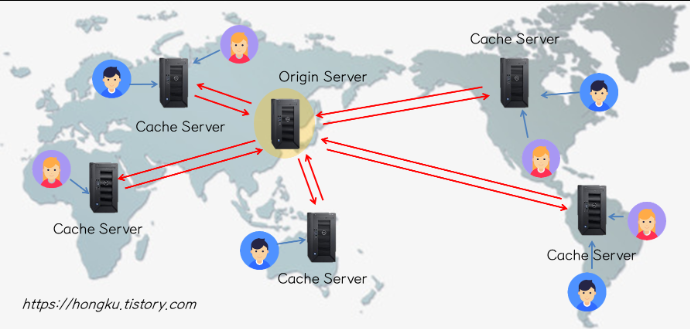

CDN(Content Delivery Network)이란 무엇이며, 왜 사용하나요?

---

# CDN (Content Delivery Network)

- 웹 콘텐츠를 사용자에게 더 빠르고 효율적으로 전달하기 위해 전 세계에 분산된 서버 네트워크
- 콘텐츠를 캐싱하여 사용자에게 가장 가까운 서버에서 제공
- 전송 속도와 성능을 최적화하여 웹사이트 로딩 시간을 줄이고 사용자 경험을 향상

## 주요 구성 요소

- Origin Server (원본 서버)
  - 콘텐츠의 원본이 저장된 서버
  - CDN은 이 서버로부터 콘텐츠를 복사하여 분산
- Edge Server (엣지 서버)
  - 전 세계에 분산된 서버
  - 사용자와 가까운 위치에 있어 콘텐츠를 빠르게 제공
- Cache Server (캐시 서버)
  - 엣지 서버에 저장된 일시적인 저장소
  - 콘텐츠 요청에 대한 응답 시간을 줄임

# CDN 동작원리

> 비디오 스트리밍 서비스인 Netflix는 CDN을 사용하여 전 세계 사용자에게 고화질 비디오 콘텐츠를 빠르고 안정적으로 제공 
> 각 지역의 사용자들은 가까운 엣지 서버에서 비디오 데이터를 스트리밍받아 지연 시간을 최소화하고 버퍼링을 줄임

1. Bob이 영화보려고 netcinema.com에 영화 파일 주소를 요청
2. netcinema.com/@#R*@#에)(url:hostname/filename)에 있다고 답변
3. Bob의 Local DNS(LDNS)에게 파일 주소(url)인 netcinema.com/@#R*@#에)를 요청
4. LDNS는 .com DNS 서버에게 요청
5. .com은 netcinema.com의 Authoratative DNS Server의 hostname을 답변
6. Authoratative DNS Server는 KingCDN.com/23483r29를 답변 (CNAME)
7. 해당 도메인을 관장하는 DNS 서버에게 다시 요청. KingCDN.com의 주소를 받음
8. LDNS가 해당 주소를 Bob에게 돌려줌
9. video는 HTTP를 이용해 KingCDN.com에서 전달 받음

⇒ CNAME을 이용한 DNS redirection을 통해 server distribution

## CDN 캐싱 방법

### Static Caching

- 사용자의 요청이 없어도 원본 서버에 있는 콘텐츠를 운영자가 미리 Cache Server에 복사함
- 사용자가 Cache Server에 접속하여 Content를 요청하면 무조건 그 Content는 Cache Server에 있음! (100% Cache Hit)
- 대부분 국내 CDN에서 이 방식을 사용
- 예시. Pooq 동영상 스트리밍/다운로드, NCSOFT 게임파일 다운로드 등
    
### Dynamic Caching

- 최초 Cache Server에는 Content가 없음
- 사용자가 Content를 요청하면 해당 Content가 있는지 확인
- 없으면(Cache Miss) 원본 서버로 부터 다운로드 받아(Cache Fill) 사용자에게 전달
- 이후 동일 Content 요청은 캐싱된 Content를 사용자에게 전달(Cache Hit)
- 각 Content는 일정 시간(TTL)이 지나면 Cache Server에서 삭제될 수 있음
- 또는 원본 서버를 통해 Content Freshness 확인 후에 계속 가지고 있을 수 있음
- Akamai, Amazon과 같은 Global CDN 업체, 그리고 Cisco나 ALU의 통신사업자향 CDN 장비 솔루션에서 이 방식을 지원

# CDN의 장단점

## 장점

1. 속도 향상
   - 지연 시간 감소
     - 사용자가 가까운 서버에서 콘텐츠를 제공받아 네트워크 지연 시간이 줄어듦
   - 빠른 전송
     - 대용량 파일을 빠르게 전송하여 사용자 경험을 개선
   - 대역폭 비용 절감
   - 캐싱
     - 엣지 서버에서 콘텐츠를 제공하므로 원본 서버로의 요청이 줄어 대역폭 비용을 절감
   - 확장성
2. 트래픽 분산
   - 트래픽이 여러 엣지 서버에 분산되므로 한 서버에 과부하가 걸리는 것을 방지
   - 글로벌 확장
     - 전 세계 사용자에게 콘텐츠를 빠르게 제공할 수 있어 글로벌 서비스를 쉽게 확장할 수 있음
3. 신뢰성 및 가용성
   - 중복성
     - 여러 엣지 서버에 콘텐츠를 복사하여 저장
     - 하나의 서버가 다운되더라도 다른 서버에서 콘텐츠를 제공 가능
   - 복원력
     - DDoS 공격 같은 상황에서 트래픽을 분산시켜 공격의 영향을 최소화
4. SEO 향상
   - 페이지 로딩 속도 개선
     - 검색 엔진에서 페이지 로딩 속도가 중요한 순위 결정 요소임
     - CDN을 사용하면 검색 엔진 최적화(SEO)에 긍정적

## 단점

1. 비용
   - 서비스 비용
     - 고성능 CDN 서비스는 비용이 많이 들 수 있음
   - 추가 관리 비용
     - CDN 설정 및 관리에 추가적인 인적 자원이 필요할 수 있음
2. 복잡성
    - 설정 및 통합
      - CDN을 기존 인프라와 통합하는 과정이 복잡할 수 있음
    - 캐시 무효화
      - 콘텐츠가 업데이트될 때 캐시를 무효화하는 작업이 필요할 수 있음
3. 일관성 문제
   - 캐싱 지연
     - 콘텐츠가 업데이트되었지만 모든 엣지 서버에 즉시 반영되지 않는 경우가 발생할 수 있음
