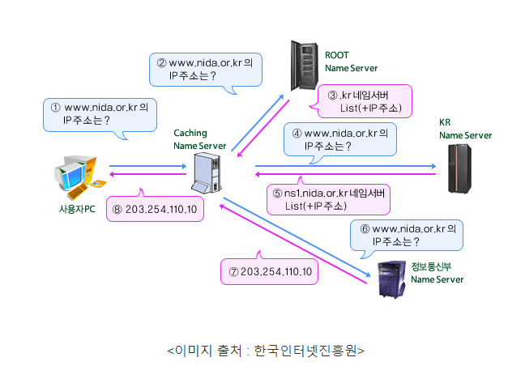
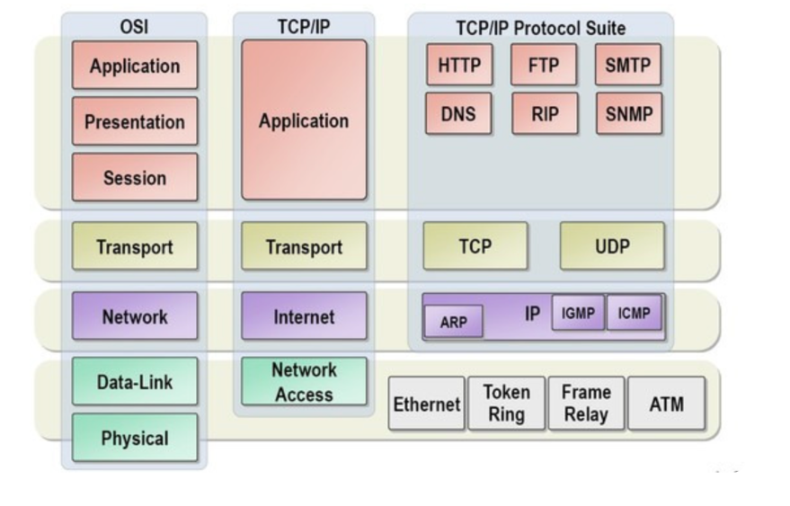

웹 통신의 큰 흐름: https://www.google.com/ 을 접속할 때 일어나는 일
 
--- 

# URL 호출 흐름

1. 해당 URL의 주소(IP)를 알기 위해 DNS 서버에 이름 검색
2. IP를 찾으면 앞에 https:// 에 나와있듯이 https 프로토콜을 사용하여 메세지 생성
3. https는 443 포트를 사용하는것을 약속하므로 xxx.xxx.xxx.xxx:443 포트로 TCP 연결
4. 연결된 서버로 데이터를 요청하면 요청 받은 서버는 리턴값을 되돌려 줌
5. 받은 데이터는 웹브라우저가 랜더링
6. 웹브라우저를 통해 우리가 흔히 보는 https://www.google.com/ 에 접속 가능

# DNS server 란

- 특정 도메인 주소와 연결된 IP를 알려주는 Server
- 예를 들어 naver.com은 naver.com 으로 바로 연결이 되는게 아님
- naver.com 도메인을 쓰는 특정 IP와 이어 주는 역할



# **참고 사항**

## TCP 4계층

- TCP는 애플리케이션, 전송, 인터넷, 네트워크 액세스의 네 가지 계층으로 구성
- 흔히 보는 OSI 7 Layer 와 비슷해 보이지만 관련은 없음

### 4계층: 어플리케이션

- HTTP(Hyper Text Trasfer Protocol)
- FRP(File Transfer Protocol)
- SMTP(Simple Mail Trasfer Protocol)
- OSI 7계층으로 생각하면, 7계층(응용계층), 6계층(표현계층), 5계층(세션계층)

### 3계층: 트랜스포트 계층

- TCP(Transmisson Control Protocol)
- UDP (User Datagram Protocol)
- OSI 7계층으로 생각하면, 4계층(전송계층)

### 2계층: 인터넷 계층

- IP(Internet Protocol)
- ARP(Address Resolution Protocol)
- OSI 7계층으로 생각하면, 3계층(네트워크계층)

### 1계층: 인터페이스 계층

- 이더넷
- 프레임 릴레이
- PPP(Point-to Point Protocol)
- OSI 7계층으로 생각하면, 2계층(데이터링크계층), 1계층(물리계층)



---

## **질문사항**

### *Q1. TCP 전송은 데이터를 한번에 전송하기도 하지 않나요? 꼭 나눠서 패킷별로 전송하고 있나요?*
 
```
한번에 여러개를 전송을 하기도 합니다. 송신자와 수신자는 서로 성능이나 사양이 다를 수 있어서 효율적으로 
데이터를 주고 받기 위해서 흐름제어라는 방식을 사용합니다. 흐름제어는 슬라이딩 윈도우(Sliding Window) 
라는 방식을 사용을 하고 있는데 윈도우 즉 받을 수 있는 메모리의 양을 적어두고 해당 메모리의 양만큼 패킷을 
전송하는 방식입니다. 중간에 데이터가 유실되면 유실된 부분 부터 해서 메모리를 다시 보내줍니다.
```  
※ 참고: [흐름제어 기법](https://velog.io/@haero_kim/TCP-%ED%9D%90%EB%A6%84%EC%A0%9C%EC%96%B4-%EA%B8%B0%EB%B2%95-%EC%82%B4%ED%8E%B4%EB%B3%B4%EA%B8%B0)

### *Q2. SOCKET와 TCP의 차이점? 다른점?*

```
socket은 해당 연결의 목적지의 역할입니다. 마치 IP와 비슷한 느낌이라고 생각을 하시면 됩니다. 
TCP는 프로토콜 즉 통신 방식으로 SOCEKET 연결에 TCP 프로토콜을 사용할 수가 있습니다.

소켓: 네트워크 통신을 위한 인터페이스, 다양한 프로토콜(TCP, UDP 등) 사용 가능  
TCP: 신뢰성 있고 순서가 보장된 데이터 전송을 제공하는 전송 계층 프로토콜
```