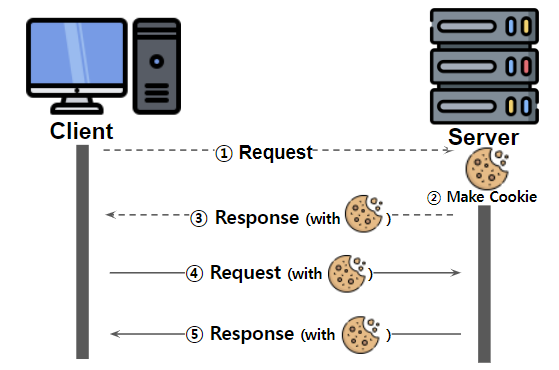
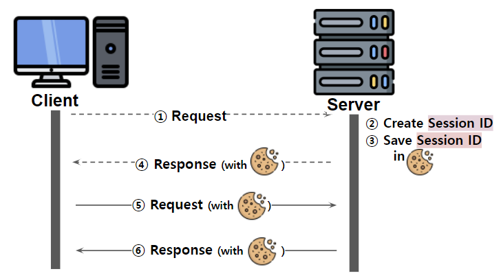

쿠키(Cookie)와 세션(Session)의 차이점에 대해 말해주세요.

---

# Cookie (쿠키)

- 클라이언트에 저장되는 키와 값이 들어있는 데이터
- 클라이언트 상태 정보를 로컬 브라우저에 저장
- 사용자 인증이 유효 시간을 명시하기 때문에 브라우저가 종료되어도 인증이 유지됨
- 사용자가 따로 요청하지 않아도 브라우저가 Request할 때 자동으로 Header에 넣음

## 구성 요소

- 이름
    - 쿠키를 구별하는데 사용
- 값
    - 쿠키 이름에 해당되는 값
- 유효 시간
    - 쿠키 유지 시간
- 도메인
    - 쿠키를 전송할 도메인

## 작동 방식

1. 클라이언트가 사용자 정보를 넘겨 로그인 요청
2. 서버에서 사용자 정보를 이용하여 쿠키 생성
3. 서버는 HTTP 헤더에 쿠키를 포함하여 응답
4. 클라이언트는 전달 받은 쿠키를 보관하고 다시 요청할 때마다 HTTP 헤더에 쿠키와 함께 보냄 
5. 쿠키의 상태 변경이 필요하면 서버에서 쿠키를 업데이트하여 변경된 쿠키로 응답

# Session (세션)

- 쿠키를 기반으로 작동
- 사용자 정보를 브라우저가 아닌 서버에서 관리
- 만료 시간을 짧게 설정하여 일정 시간 응답이 없으면 연결 해제
- 로컬 브라우저가 서버에 접속하여 브라우저를 종료할 때까지 인증 상태 유지
- 클라이언트가 Request를 보내면 서버에서 고유 ID를 부여

## 동작 방식

1. 클라이언트가 사용자 정보를 넘겨 로그인 요청
2. 서버는 사용자 인증 후 세션 ID를 생성
3. 서버는 생성된 세션 ID를 세션 저장소에 저장
4. 서버는 세션 ID 정보를 쿠키로 응답
5. 클라이언트는 세션 ID를 쿠키 저장소에 보관하고 요청할 때 세션 ID를 쿠키로 전달하여 요청
6. 서버는 전달 받은 세션 ID로 사용자 정보를 가져와서 사용 후 응답

# Cookie와 Session

## 사용하는 이유

- HTTP 특성인 Connectionless, Stateless 환경을 보완하기 위함
- Connectionless (비연결)
    - 클라이언트가 요청을 한 후 응답을 받으면 연결을 끊음
    - 서버는 클라이언트에게 요청을 받고 응답을 보내면 접속을 끊음
    - 매번 새로운 연결을 위해 연결/해제의 과정을 거침
    - Keep-Alive를 활용하여 Connection을 재활용할 수 있도록 보완
- Stateless (무상태)
    - 통신이 끝나면 상태를 유지하지 않음
    - 통신할 때마다 인증이 필요
    - 쿠기 또는 세션을 이용하여 문제 해결

## 차이점

- 쿠키와 세션의 역할은 동일하며 동작 원리도 비슷함
- 가장 큰 차이점은 사용자 정보의 저장 위치임
- 저장 위치의 차이로 장점 및 단점이 나뉨

|            | Cookie                                     | Session          |
|------------|--------------------------------------------|------------------|
| 저장 위치      | 클라이언트(브라우저, 로컬 컴퓨터)                        | 서버(웹사이트)         |
| 보안         | 취약(스니핑의 위험)                                | 강함               |
| Life Cycle | 브라우저를 종료와 관계없이 만료 시점만 확인                   | 브라우저가 종료되면 삭제    |
| 속도         | 쿠키에 정보가 있기 때문에 빠름                          | 서버 처리가 요구되어 느림   |
| 저장 형식      | Text                                       | Object           |
| 용량         | 총 300 개로 제한적, 하나의 도메인 당 20 개, 하나의 쿠키 당 4KB | 서버가 허용하는 한 제한 없음 |