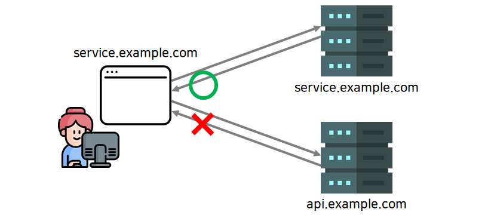
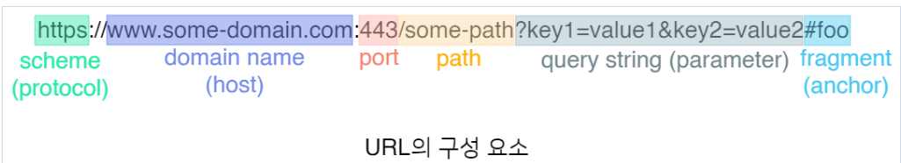
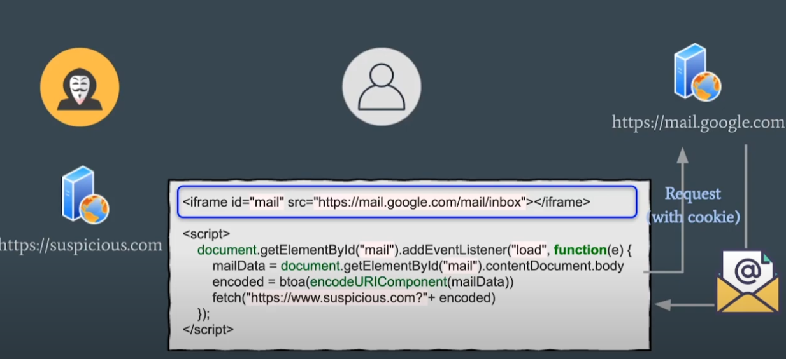
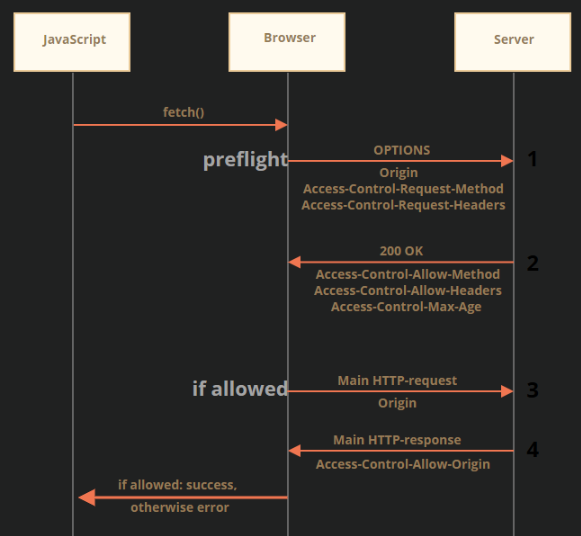

CORS란 무엇이며 이것에 대해서 설명해보세요.

---

# SOP (Same-Origin Policy; 동일 출처 정책)



- 브라우저의 정책
- 브라우저는 출처가 동일한 경우에만 리소스를 공유할 수 있게 제한하고 있음
- 즉, 같은 출처에서 호출된 값만 리턴을 해주는 정책
- SOP 정책이 없으면 외부에서 호출이 가능하여 데이터를 탈취할 수가 있음
- 악의적인 사이트가 다른 사이트의 정보를 읽을 수 없게 된다는 장점이 있음

## Origin (출처)란



- URL의 구성 요소 중 scheme, domain name, port 세 가지가 합쳐진 것을 origin 이라고 함
- 포트 번호가 생략되어 있다면 기본 포트를 기준으로 함(HTTP의 경우 80, HTTPS의 경우 443) 
- 위 그림과 같이 포트가 명시되었다면 명시된 포트 번호를 기준으로 함

### 예시 

- GET https://test.site/member 호출을 하면 member 정보 조회 가능
- SOP 정책으로 https://test.site 에서 호출하는 GET 호출만 받아올 수 있음
- 다른 서버가 해당 GET 호출을 하면 거부됨 

#### SOP 없을 때



- 헤커가 만든 사이트에 들어가면 iframe을 통해서 google 메일 서버에 호출
- google 브라우저엔 로그인 세션을 유지하는 쿠키를 저장을 하고 있어서 해당 호출이 먼저 동작
- 사용자는 쿠키 정보를 받아서 헤커에게 전송
- 해커에게 데이터가 탈취

#### SOP 있을 때 


- 위와 같이 출처가 다르기 때문에 일단은 리턴데이터를 받아지지만 
- 브라우저에서는 origin이 다르기 때문에 해당 데이터에 접근하는 것을 막음

## CORS 정책이 필요한 이유

- SOP 정책으로 인해 다른 출처의 자원을 사용할 수 없지만 유효한 요청도 막아버림
- 웹은 개방되어 있으므로 출처가 다른 곳에서 리소스를 가져오는 행위는 상당히 빈번함 
- 출처가 다른 리소스를 사용할 수 있도록 하는 예외 조항이 있음
- 그 중 하나가 CORS 정책

# CORS (Cross-Origin Resource Sharing; 교차 출처 리소스 공유)

- 브라우저의 정책
- sop를 피해 다른 서버에서 호출을 가능하게 해주는 기능
- 현재 서버에 호출할 수 있는 리스트를 지정하는 것이 CORS

> 주의 사항
> 다른 출처의 리소스를 제한하는 것은 서버가 아닌 브라우저
> CORS 정책을 위반하였을 때 차단하는 곳은 브라우저
> 즉, Postman처럼 브라우저가 아닌 환경에서는 통신이 원활

## Flask 사용방법

```bash
pip install flask_cors
```


```python
from flask_cors import CORS

CORS(app,resource={r'*':{'origins':'*'}})
CORS(app,resource={r'/api/*':{'origins':'*'}}) # /api/로 시작되는 end_point만 허용
```

## 브라우저에서만 기능이 있는 이유

- 쿠키 및 세션 보안을 위함
- 브라우저는 웹 페이지 로그인 세션을 유지하기 위해 쿠키 사용
- CORS를 사용하여 악의적인 웹 페이지가 사용자의 쿠키에 접근하여 민감한 정보를 탈취하는 것을 방지

## CORS의 3가지 동작 시나리오

### Preflight Request



- 브라우저가 예비 요청과 본 요청으로 나누어 서버로 전송
- 이때 예비요청을 Preflight
- 실제 CORS가 발생하는 요청이 안전한지 확인함
- OPTIONS 메서드를 사용하여 Preflight Request을 보냄

#### Preflight 조건

- 요청 메서드가 GET, HEAD, POST 이외의 메서드일 경우 (예: PUT, DELETE)
- 커스텀 헤더를 포함하는 경우 (예: X-Custom-Header)
- Content-Type이 application/x-www-form-urlencoded, multipart/form-data, text/plain 이외의 값인 경우

#### Preflight 요청 및 응답

```
OPTIONS /data HTTP/1.1
Origin: https://example.com
Access-Control-Request-Method: DELETE
```

- Preflight 요청은 OPTION HTTP 메서드를 사용

```
HTTP/1.1 200 OK
Access-Control-Allow-Origin: https://example.com
Access-Control-Allow-Methods: GET, DELETE, HEAD, OPTIONS
Access-Control-Max-Age: 86400
```

- 요청을 받은 서버의 응답값
- 허용하는 출처와 허용하는 메서드, preflight 요청을 캐시하는 시간 등이 있음

### Simple Request

- Preflight Request 보내지 않고 바로 서버에 요청

#### Simple Request 조건

- 요청 메서드가 GET, HEAD, POST 중 하나인 경우
- Content-Type이 application/x-www-form-urlencoded, multipart/form-data, text/plain 중 하나인 경우
- 커스텀 헤더를 포함하지 않는 경우

#### Simple Request 요청

```
GET /path/to/resource HTTP/1.1
Host: example.com
Origin: http://example.com
```

### Credentialed Request

- HTTP 쿠키와 같이 인증 정보를 포함하는 요청을 보냄

#### Credentialed Request 조건

- withCredentials 속성이 true로 설정된 경우
- 요청에 쿠키 또는 인증 헤더가 포함된 경우

#### Credentialed Request 요청

```
GET /path/to/resource HTTP/1.1
Host: example.com
Origin: http://example.com
Cookie: sessionId=abc123
```
