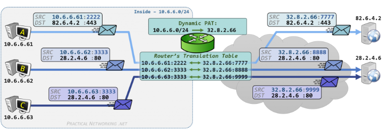
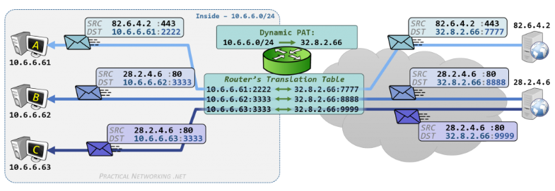

공인(public) IP와 사설(private) IP의 차이에 대해 설명해주세요.

---

# IP (Internet Protocol)

- 인터넷에 연결되어 있는 모든 장치들을 식별할 수 있는 고유 주소
- 컴퓨터, 서버 장비, 스마트폰 등의 장비에게 부여

## IPv4

- IPv4는 IP version 4의 약자
- 전 세계적으로 사용된 첫 번째 인터넷 프로토콜
- 일반적으로 마침표로 구분된 4개의 숫자가 점으로 분리된 10진수 형식(172.16.254.1)으로 표시
  - 2진법으로 표현(32Bit) -> 10101100.00010000.1111110.0000001
- 32Bit로 이루어져 약 0 ~ 2^32 (약 42억 9천)개의 주소를 가질 수 있음
- 전 세계적으로 인터넷 사용자 수가 급증하면서 IPv4 주소가 고갈될 위기에 처해 있음 

## IPv6

- IPv6는 IP version 6의 약자
- IPv4의 주소체계를 128Bit 크기로 확장한 차세대 인터넷 프로토콜 주소 
- 콜론으로 구분되며 16비트씩 8자리로 구성
- 128Bit 주소공간으로 0 ~ 2^128 (약 340간 2823구)개의 주소를 가져 무한대로 사용 가능

## IP의 상용화

- 요즘엔 컴퓨터, 공유기, 스마트티비 등 IP주소를 할당받은 전자 기기들이 개인마다 많음 
- IPv4가 43억개는 충분히 많은 양이 아니며 이미 고갈된 상태 
- 새로운 주소체계인 IPv6가 나왔지만 기존의 주소체계를 변경하는데 비용이 많이 들어 완전히 상용화가 되지 않음
- 지금까지 문제없이 사용하고 이유는 기존의 주소체계에서 일종의 수학적 트릭을 고안해서 사용하기 때문 
- 그 트릭 중 하나가 사설 IP 개념임

# IP 종류

## 고정 IP

- 변하지 않고 컴퓨터에 고정적으로 부여된 IP
- 한번 부여되면 IP 반납을 하기 전까지는 다른 장비에 부여할 수 없는 고유의 IP
- 보안성이 우수하기 때문에 보안이 필요한 업체나 기관에서 사용

## 유동 IP

- 변하는 IP
- 인터넷 사용자 모두에게 고정 IP를 부여해 주기는 힘듦
- 일정한 주기 또는 사용자들이 인터넷에 접속하는 매 순간마다 사용하고 있지 않은 IP 주소를 임시로 발급
- 대부분의 사용자는 유동 IP를 사용

## 공인 IP

- IP 주소는 임의로 우리가 부여하는 것이 아니라 전 세계적으로 ICANN이라는 기관이 국가별로 사용할 IP 대역을 관리
- 우리나라는 한국인터넷진흥원(KISA)에서 국내 IP 주소들을 관리
- 이것을 ISP(Internet Service Provider의 약자로 KT, LG, SKT와 같이 인터넷을 제공하는 통신업체)가 부여받음
- 우리는 위 회사에 가입을 통해 IP를 제공받아 인터넷을 사용
- 이렇게 발급받은 IP를 공인 IP라고 함

## 사설 IP

- 사설 IP는 어떤 네트워크 안에서만 내부적으로 사용되는 고유한 주소
- 공유기를 사용한 인터넷 접속 환경일 경우 공유기까지는 공인 IP 할당
- 공유기에 연결되어 있는 가정이나 회사의 각 네트워크 기기에는 사설 IP 할당
- 사설 IP는 보통 내 컴퓨터에서 사용하는 로컬 IP

## 공인 IP와 사설 IP의 차이

| 공인 IP                     | 사설 IP           |
|---------------------------|-----------------|
| 전 세계에서 유일                 | 하나의 네트워크 안에서 유일 |
| 외부, 내부 상관없이 해당 IP에 접속 가능  | 내부에서만 접근이 가능    | 

# 네트워크 환경

## 사설망

- 사설 IP를 할당하여 그룹으로 묶는 방법
- 학교를 인터넷으로 비유할 때 반은 사설망, 반장이 게이트웨이(Gateway) 학생들은 각 전자기기
- 학교 회의 때 모든 사람을 대표할 수 있는 반장을 뽑는 것
- 사설망 안의 컴퓨터는 NAT을 통해 외부와 통신

## NAT (Network Adress Translation; 네트워크 주소 변환)

- IP 패킷의 TCP/UDP 포트 숫자와 소스 및 목적지의 IP 주소 등을 재기록하여 네트워크 트래픽을 주고 받는 기술
- 주로 사용되는 NAT 유형은 PAT (Port Address Translation)
- 이 과정에서 NAT 라우터는 변환 테이블을 유지하며, 내부 IP와 포트, 공인 IP와 포트 간의 매핑 정보를 관리합니다.

## PAT (Port Address Translation)

- 내부 네트워크의 여러 디바이스가 인터넷에 접속할 때 각 디바이스의 소스 포트를 수정
- 공인 IP 주소와 포트 번호를 조합하여 트래픽 구분

### PAT 동작 예시

- A 디바이스(10.6.6.61)가 외부 서버(82.6.4.2)로 요청을 보냄
- NAT 라우터는 소스 IP를 공인 IP(32.8.2.66)로 변환
- 소스 포트(2222)를 새로운 포트(777)로 변경

- 외부 서버에서 응답을 보냄
- NAT 라우터는 목적지 IP를 내부 IP로 변환하고 포트 번호도 변경
