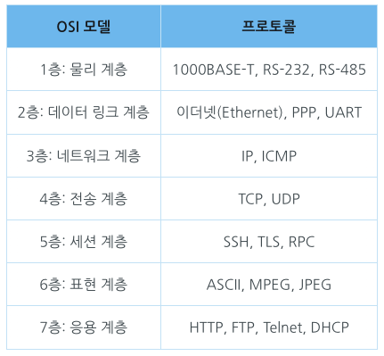
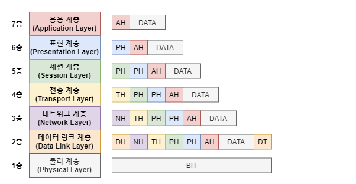
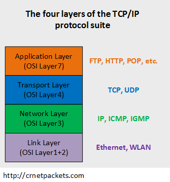
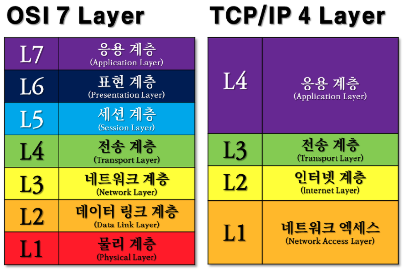
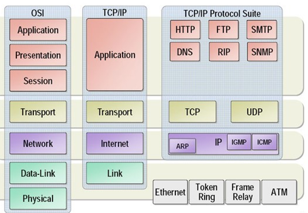
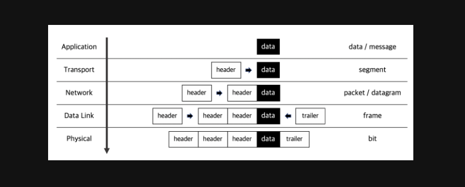
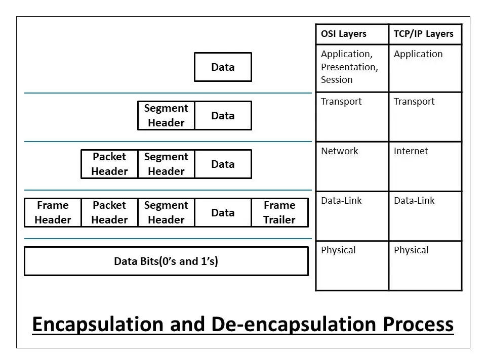
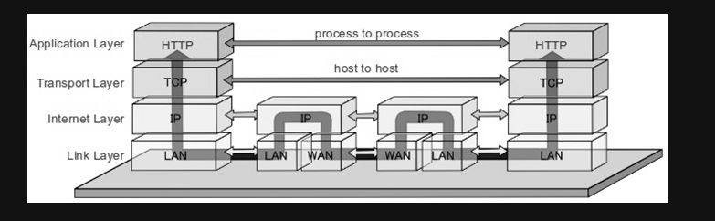

OSI 7 계층과 TCP/IP 4계층에 대해 설명해보세요.

---

# OSI 7 계층 (Open Systems Interconnection 7 Layer)

- 국제표준화기구(ISO)에서 만듦 
- 데이터를 주고 받는 단계 
- 각 계층마다 프로토콜이 존재
- 상위 계층에서 하위 계층으로 전달될 때마다 헤더가 추가되어 데이터의 크기가 커짐
- 이러한 과정을 캡슐화(Encapsulation)라고 함

# TCP/IP 4 계층

- 데이터를 주고받을 때 TCP와 IP를 많이 사용하므로 두 내용을 묶어서 지칭
- 현대의 인터넷은 TCP/IP 모델을 주로 사용함
- 인터넷 표준 프로토콜
- 각 계층이 서로 종속적

# OSI 7 계층 vs TCP/IP 4 계층

## Physical vs Network Access (Link)

- 데이터 단위는 Bit
- 0 또는 1의 데이터(Bit)로 변환되어 케이블로 통신
- 전송 데이터는 인코딩하여 전자기파로 만든 후 전송
- 받은 데이터는 디코딩하여 확인

## Data Link vs Network Access (Link)

- 데이터 단위는 Frame
- 전송 주소는 MAC
- 랜카드 등의 물리적 매체를 통해 데이터 전달
- MAC 주소를 통해 각 기기들 구분
- 데이터의 시작값과 끝값에 데이터를 붙여서 끝과 시작을 알려줌

## Network vs Internet

- 데이터의 단위는 Packet
- 전송 주소는 IP
- IP를 이용하여 Host와 Networkf를 논리적으로 구분
- 라우팅 프로토콜으로 최적의 경로 선택하여 데이터 전송 

> ### 라우터를 통한 데이터 전송 방법  
> 1. 1계층을 통해 데이터가 라우터로 전송
> 2. 라우터는 해당 프레임을 열어서 이것이 나에게 온 mac 주소인지 확인
> 3. 아니라면 아래 3계층을 열어서 IP 주소 확인
> 4. 라우팅 테이블을 조회하여 해당 IP를 가진 MAC 주소 확인
> 4. ARP(Address Resolution Protocol)를 통해 해당 MAC 주소로 프레임 재구성 후 전송

> ### ARP 프로토콜
> 브로드 캐스팅으로 연결된 모든 주소에게 전달하면 데이터를 받아 mac 주소를 알려줌

## Transport vs Transport

- 데이터 단위는 세크먼트
- 전송 주소는 Port
- 신뢰성 있는 데이터를 전달을 담당하는 계층
- TCP/UDP 가 해당 계층에 존재
- 안의 패킷을 사용하여 안에 프로세스까지 도달하게 하는 계층
- 보낼 데이터의 용량, 속도, 목적지 등을 처리
- L4 스위치(로드밸런싱)
    - 모든 요청은 L4 스위치를 통해서 들어오는데 해당 프로토콜을 분석하여 부하분산을 실행

## Session vs Application

- 연결을 유지하고 종료하는 기능을 담당
- 데이터 전송의 보안과 관련이 있음
- SSH, TLS, RPC 등이 있음

## Presentation vs Application

- 인코딩, 데이터 압축, 암호화 등을 수행하는 계층

## Application vs Application

- 데이터 단위는 데이터 또는 메세지
- 사용자와 소프트웨어간 소통을 담당하는 계층
- 서바나 클라이언트 관련 응용프로그램들이 동작하는 계층
- http 프로토콜이나 ftp 파일 전송 이메일 등이 해당
