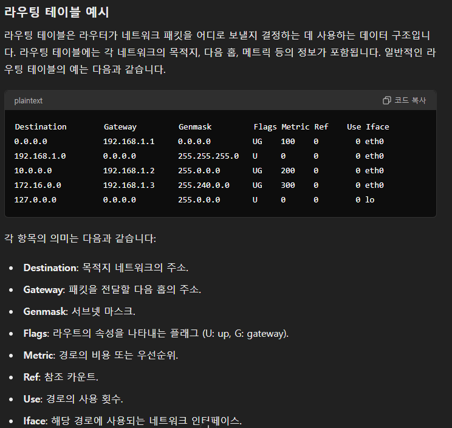
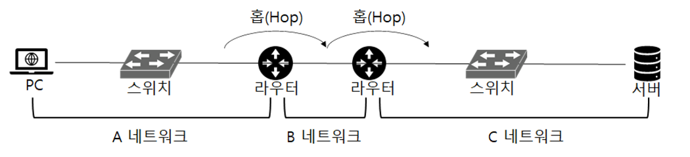

라우팅 기능 및 웹 서버 소프트웨어(Apache, Nginx)는 OSI 7계층 중 어디서 작동하는지 설명해보세요.

---

# 라우터에서의 데이터 전송

1. 1계층에서부터 라우터(3계층)로 데이터 전송
2. 라우터에서 전자기파 내용을 디코딩
3. 데이터를 열어 프레임 확인
4. MAC 주소 확인
5. MAC 주소가 맞으면 데이터를 열어서 목적지에 데이터 전달
5. MAC 주소가 아닐 때 IP 주소 확인
6. ARP를 통해 IP주소에 해당되는 MAC 주소 확인
7. 프레임 재구성
8. 다른 라우터로 전송
 

# ARP (Address Resolution Protocol)

- 네트워크 내에서 IP 주소를 물리적인 MAC 주소로 변환하는 프로토콜
- 데이터 링크 계층과 네트워크 계층 사이에서 작동

## ARP의 주요 개념

- IP 주소 (Internet Protocol Address)
  - 네트워크 계층에서 사용
  - 네트워크 내에서 장치를 식별
  - ex) 192.168.1.10
- MAC 주소 (Media Access Control Address)
  - 데이터 링크 계층에서 사용
  - 고유한 하드웨어 주소
  - 네트워크 인터페이스 카드(NIC)에 할당
  - ex) 00:1A:2B:3C:4D:5E

##  ARP 작동 과정

1. ARP 요청 (ARP Request)
   - 장치 A가 192.168.1.20을 가진 MAC 주소를 알아야 할 때 브로드캐스트 요청 패킷을 네트워크에 보냄
   - 패킷에는 A의 MAC, IP 주소 그리고 상대방 IP 주소가 포함
   - ARP 요청을 수신한 장치는 IP 주소 확인
   - IP 주소가 일치한 장치는 자신의 MAC 주소를 포함하여 ARP 응답 패킷을 유니캐스트로 보냄
2. ARP 캐시 (ARP Cache)
   - 응답을 수신한 장치 A는 IP 주소와 MAC 주소의 매핑
   - ARP 캐시에 저장
   - 캐시는 일정 시간 동안만 유지

# 라우터 간 이동

- 서버 A  ->  라우터 1  ->  라우터 2  ->  라우터 3  ->  서버 B
- 라우터 사이를 거치는 방법을 홉이라고 함
- A에서부터 B까지 3개의 라우터를 거치므로 총 4개의 홉이 있음
- 홉 수를 줄여 네트워크 성능을 최적화
- 홉 라우팅 방식은 주로 Dynamic Routing 프로토콜을 사용
- 다이내믹 라우팅 프로토콜은 라우터가 자동으로 라우팅 테이블을 업데이트하여 최적 경로를 선택

## Routing Protocol

- RIP (Routing Information Protocol)
  - 거리 벡터 라우팅 프로토콜
  - 홉 수를 기준으로 최적 경로 결정
  - 최대 홉 수가 15로 제한
  - 작은 네트워크에 적합
- OSPF (Open Shortest Path First)
  - 링크 상태 라우팅 프로토콜
  - 라우터들이 전체 네트워크의 맵을 공유하여 최단 경로를 계산
  - 대규모 네트워크에 적합
  - 빠른 수렴 속도를 제공
- BGP (Border Gateway Protocol)
  - 경로 벡터 라우팅 프로토콜
  - 자율 시스템(AS) 간 경로 정보를 교환
  - 인터넷의 기본 라우팅 프로토콜
  - 대규모 네트워크와 ISP 간의 라우팅에 사용

## Route Caching

- 라우팅 테이블을 확인 전에 캐시를 먼저 확인
- 출발지 IP, 도착지 IP, 포트 번호가 모두 동일한 곳으로 여러 패킷이 연속적으로 보내지기 때문에 사용

---

# 웹서버의 동작원리

1. 클라이언트 요청
   - 클라이언트(웹 브라우저)가 URL 입력하여 웹페이지 요청
   - 웹 브라우저는 HTTP 요청 메시지를 생성 
   - 메시지에는 요청 메서드(GET, POST 등), URL, HTTP 버전, 헤더 정보 등을 포함
2. DNS 조회
   - 도메인 네임 시스템(DNS) 조회
   - DNS 서버를 통해 도메인 이름을 IP 주소로 변환(ex. www.example.com -> 93.184.216.34) 
3. 서버 접속
   - 클라이언트는 웹 서버와 TCP/IP 연결
4. HTTP 요청 전송
   - 클라이언트는 는 생성된 HTTP 요청 메시지를 웹 서버로 전송
5. 요청 처리
   - 웹 서버는 HTTP 요청을 수신 후 처리
6. 응답 생성
   - HTTP 응답 생성(ex. 200 OK, 404 Not Found 등)
7. 응답 전송
   - 웹 서버는 생성된 HTTP 응답 메시지를 클라이언트로 전송
8. 클라이언트 처리
   - 웹 브라우저는 수신한 HTTP 응답을 처리
   - 사용자에게 웹 페이지를 표시
9. 연결 종료
   - 응답이 전송되면 서버와 클라이언트 간 TCP 연결 종료

---

# 라우팅 기능 및 웹 서버 소프트웨어(Apache, Nginx)의 계층

## 라우팅 기능가 OSI 3계층인 이유

- 데이터의 단위가 패킷
- IP를 이용하여 패킷 전달
- 라우팅 프로토콜 사용 

## 웹 서버가 OSI 7 계층이 이유

- 데이터 단위가 메세지
- 사용자와 소프트웨어 간 소통을 담당
- 서버나 클라이언트 관련 응용 프로그램들이 동작
- HTTP 프로토콜 사용
