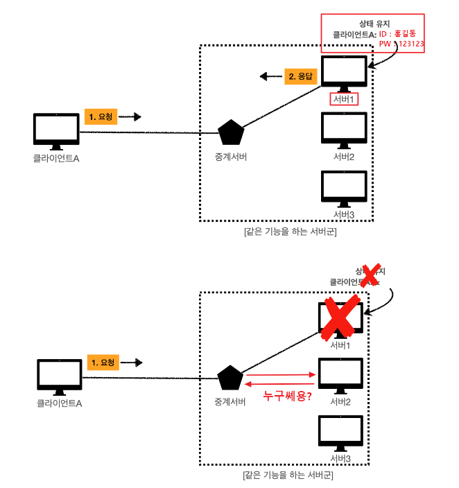
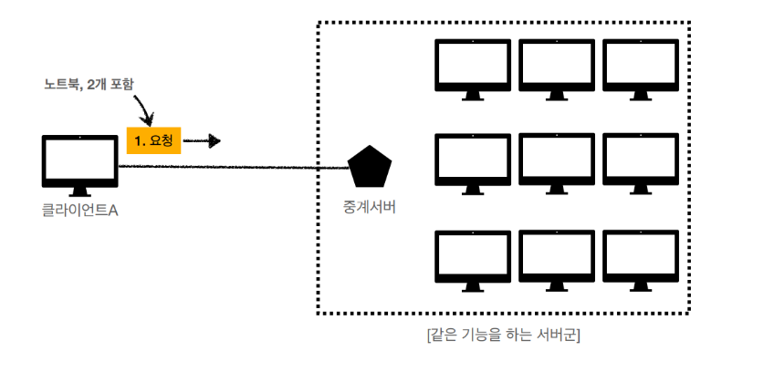

상태비저장(stateless) 프로토콜이란 무엇인가요?

---

# Stateful 과 Stateless 차이점

# Stateful (상태유지)

- 클라이언트와 서버 관계에서 서버가 클라이언트의 상태를 보존
- 클라이언트 서버 간 송수신을 단계별로 진행할 때 서버에서 이전 단계에서의 클라이언트의 제공값을 저장한 상태
- TCP가 대표적인 예시
- 3way-handshake 이후에 상태를 저장하므로 서로 주고 받기 가능

## Stateful의 문제점

- 유저가 로그인을 하고 게시판 페이지에 들어감
- 로그인 정보를 들고 있는 서버가 어떠한 문제로 인해 다운
- 다른 서버가 이전 서버의 역할을 대신 이어 받음
- 유저는 글을 쓰기 위해 [글쓰기] 를 눌렀더니 다시 로그인 하라는 화면이 뜸

> 즉, 서버 다운으로 인해 클라이언트의 로그인 정보가 사라짐
> 기존서버에서 새로운서버로 이전 데이터를 모두 전달해준다면 문제 없음

# Stateless (무상태)

- 무상태는 클라이언트와 서버 관계에서 서버가 클라이언트의 상태를 보존하지 않음
- Stateless 구조에서 서버는 요청이 오면 응답을 보내는 역할만 수행
- 상태 관리는 전적으로 클라이언트에게 책임이 있음
- 클라이언트와 서버 간 통신에서 필요한 모든 상태 정보들은 클라이언트가 가짐
- 클라이언트는 서버와 통신할때 모든 데이터를 실어 보냄
- 서버는 단순히 받아서 응답만 해주기 때문에 상태 유지에 대한 부하가 현저히 줄어듦
- 상태를 보관하지 않아 서버 1에 문제가 생겨 서버 2가 이어 받아도 응답하는데 있어 문제 없음
- 대표적인 Stateless 프로토콜로 UDP와 HTTP, 메세지 큐가 있음

## 무상태 특징(장점)

1. 독립된 요청
   - 각 요청은 독립적
   - 이전 요청의 컨텍스트에 의존하지 않음
   - 서버는 이전 요청의 상태를 기억하지 않으므로, 클라이언트는 필요한 모든 정보를 요청에 포함해야 함
2. 확장성
   - 서버는 각 요청을 독립적으로 처리하므로 서버의 확장성을 높임
   - 요청 처리 중 상태를 관리할 필요가 없음
   - 서버의 부하를 줄이고 확장이 용이
   - 서버 팜에서 여러 서버가 동시에 요청을 처리할 수 있음
3. 단순성
   - 서버 측의 상태 관리를 없애므로 서버 구현 단순화
   - 클라이언트가 요청에 필요한 모든 정보를 포함하도록 책임을 지게 됨
4. 안정성
   - 서버가 중단된 후에도 상태가 저장되지 않음
   - 재시작 시 상태 복원에 대한 걱정이 없음
   - 높은 가용성 제공

## 무상태 문제점

- 중복 데이터 전송
  - 클라이언트가 각 요청마다 필요한 모든 정보를 전송
  - 데이터 중복 전송이 발생할 수 있음
  - 매번 요청할때마다 자신의 부가정보를 줘야하므로 더 많은 데이터 소모
- 상태 유지 필요 시 복잡성 증가
  - 애플리케이션 수준에서 상태를 유지해야 함
  - 클라이언트가 이를 처리해야 하므로 복잡성 증가
  - 클라이언트에서 토큰 값을 저장 및 전송

=> 해결 방안: 쿠키, 세션, 토큰 등등
