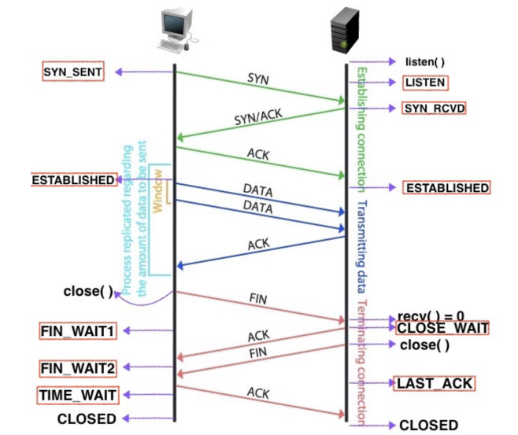
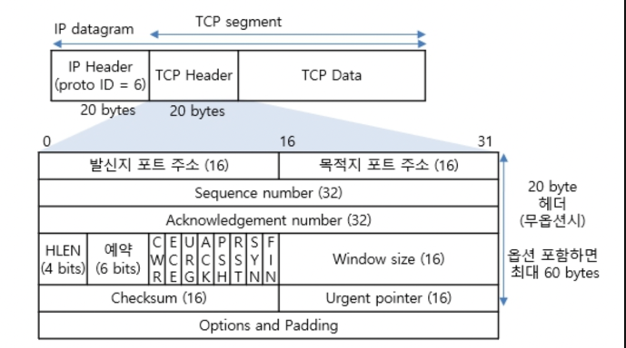
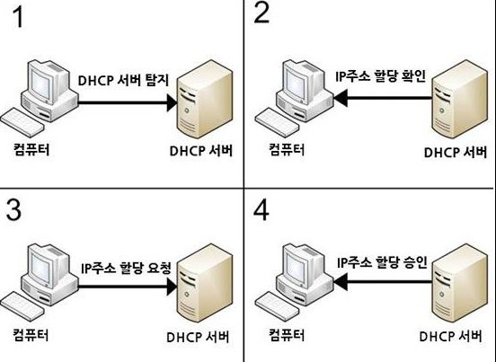
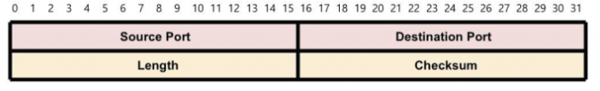

TCP와 UDP의 각각의 기능과 차이점 대해서 설명해보세요.

---

# TCP (Transmission Control Protocol)

1. 연결 지향(Connection-oriented)
  - TCP는 데이터 전송을 시작하기 전에 송신자와 수신자 간에 연결을 설정 
  - 연결은 일반적으로 3-way 핸드셰이크(three-way handshake) 절차를 통해 이루어짐 



2. 신뢰성 있는 전송(Reliable transmission)
  - TCP는 데이터가 정확하고 순서대로 전달되도록 보장 
  - 만약 데이터 패킷이 손실되거나 손상되면 재전송
3. 흐름 제어(Flow control)
  - TCP는 송신자가 수신자의 처리 능력을 초과하지 않도록 데이터를 조절하여 전송
4. 혼잡 제어(Congestion control)
  - 네트워크 혼잡을 감지하여 전송 속도를 조절
  - 네트워크 성능을 최적화 
  - https://velog.io/@nnnyeong/Network-TCP-%ED%98%BC%EC%9E%A1%EC%A0%9C%EC%96%B4-Congestion-Control
5. 오류 검출 및 수정(Error detection and correction)
  - 각 데이터 패킷에 체크섬 포함
  - 데이터의 무결성 확인 및 오류 감지
6. 전이중(Full-Duplex)
  - 양방향으로 동시에 전송 가능
7. 점대점(Point to Point)
  - 각 연결이 정확히 2개의 종단점을 가지고 있음

## 사용 사례

- 웹 브라우징(HTTP/HTTPS)
- 이메일(SMTP, IMAP, POP3)
- 파일 전송(FTP)
- 원격 접속(Telnet, SSH)

## [TCP 패킷 정보](http://www.ktword.co.kr/test/view/view.php?no=1889)



### TCP Header

- 크기는 20 ~ 60 Byte

### Sourse/Destination Port Number (발신지/목적지 포트 주소)

- 각 16 Bits
- IP 주소 + 포트 번호 = 소켓 주소
- 소켓은 포트 번호에 바인딩되어 목적지 어플리케이션 식별

### Sequence Number

- 32 Bits
- 전송하는 데이터의 순서
- 잘라진 Segment를 조립하는데 사용
- 신뢰성 및 흐름제어 기능을 제공

### Acknowledgement Number

- 32 Bits
- 다음 수신을 위한 바이트 번호 = (상대방이 보낸 시퀸스 번호 + 1)
- 즉, 총 200 Byte 중 100까지 수신되었으면 다음 바이트는 101 Byte가 됨
- 32비트 워드 단위를 사용
- 32 비트 체계에서 1 Word = 4 bytes 의미
- 자료에 따라 용어가 다르지만 헤더의 길이 또는 데이터의 시작 위치를 의미

### Reserved

- 차후에 사용을 위해 남겨둔 필드
- 3개 비트 플래그(RST,SYN,FIN)는 TCP 연결설정 및 TCP 연결종료에 주도적으로 사용됨
- 기존엔 6 Bits였지만 혼잡 제어 기능의 향상을 위해 3 Bits를 Flag 필드로 넘겨 NS, CWR, ECE 플래그가 추가
- NS, CWR, ECE 플래그는 네트워크의 명시적 혼잡통보(Explicit Congestion Notification, ECN)을 위한 플래그
- 9 개의 비트 플래그(URG, ACK, PSH, RST, SYN, FIN, NS, CWR, ECE)는 현재 세그먼트의 속성을 나타냄
  - URG(Urgent Pointer 긴급 포인터)
    - 필드에 값이 채워져있음을 알리는 플래그
    - 송신측 상위 계층이 긴급 데이터라고 알려주면, 긴급비트 URG를 1 로 설정하고, 순서에 상관없이 먼저 송신됨
  - ACK(Acknowledgment 승인 번호)
    - 1로 셋팅되면, 확인번호 유효함을 뜻한다. 0으로 셋팅되면, 확인번호 미포함 (즉, 32 비트 크기의 확인응답번호 필드 무시됨)
  - PSH(Push)
    - 수신 측에게 이 데이터를 최대한 빠르게 응용프로그램에게 전달해달라는 플래그
    - 플래그가 0이면 수신 측은 자신의 버퍼가 다 채워질 때까지 기다림
    - 플래그가 1이면 이후에 더 이상 연결된 세그먼트가 없음을 의미
  - RST(Reset 강제 연결 초기화)
    - ESTABLISHE(연결확립)된 회선에 강제 리셋 요청
  - SYN(Synchronize 연결시작, 동기화)
    - TCP 연결설정 초기화를 위한 순서번호의 동기화
      - 연결요청: SYN=1, ACK=0   (SYN 세그먼트)
      - 연결허락: SYN=1, ACK=1   (SYN+ACK 세그먼트)
      - 연결설정: ACK=1          (ACK 세그먼트)
  - FIN(Finish 종료)
    - 상대방과 연결을 종료하고 싶다는 요청인 세그먼트임
      - 종결요청: FIN=1           (FIN 세그먼트)
      - 종결응답: FIN=1, ACK=1    (FIN+ACK 세그먼트)
  - NS
    - CWR, ECE 필드가 실수나 악의적으로 은폐되는 경우를 방어하기 위해 추가된 필드
  - ECE(ECN Echo)
    - 해당 필드가 1이면서, SYN 플래그가 1일 때는 ECN을 사용한다고 상대방에게 알리는 의미.
    - SYN 플래그가 0이라면 네트워크가 혼잡하니 세그먼트 윈도우(데이터의 양)의 크기를 줄여달라는 요청의 의미이다.
  - CWR
    - 이미 ECE 플래그를 받아서, 전송하는 세그먼트 윈도우의 크기를 줄였다는 의미이다.

### Window Size

- 16 Bits
- 한번에 전송할 수 있는 데이터의 양
- 2^16 = 65535 범위 내로 가능

### Checksum

- 16 Bits
- 데이터를 송신하는 중에 발생할 수 있는 오류 검출
- 검사합이 0 이면 오류 없음
- 0 이 아니면 오류 있음

### Urgent Pointer

- 16 Bits
- TCP 세그먼트에 포함된 긴급 데이터의 마지막 바이트에 대한 일련번호

### Options

- 0 ~ 40 Bytes
- TCP 연결 관리 기능을 확장시키는데 주로 사용되는 옵션 필드

# UDP (User Datagram Protocol)

1. 비연결 지향(Connectionless)
  - UDP는 연결을 설정하지 않고 데이터를 전송
  - 송신자가 일방적으로 데이터를 수신자에게 전송
2. 신뢰성이 낮음(Unreliable transmission)
  - UDP는 데이터의 전송을 보장하지 않음
  - 데이터가 손실되거나 순서가 바뀌어도 재전송을 하지 않음
3. 오버헤드가 낮음(Low overhead)
  - 프로토콜 헤더가 간단하여 TCP 보다 전송 속도가 빠름
  - 추가적인 오류 검출 및 수정, 흐름 제어, 혼잡 제어 등의 기능이 없음
4. 순서화되지 않은 전송(Unordered transmission)
  - UDP는 데이터그램을 순서에 상관없이 전송
  - 송신된 순서와 수신된 순서가 다를 수 있음
5. 1:1 & 1:N & N:N 통신이 가능

## 사용 사례:

- 실시간 스트리밍(VoIP, 비디오 스트리밍)
- 온라인 게임
- DNS(Domain Name System)
- DHCP(Dynamic Host Configuration Protocol)
  - IP 할당 서버
  - Broadcast로 패킷을 보낼 때 UDP 통신 사용



## UDP 패킷 정보



# TCP & UDP 연결

- TCP와 UDP의 가장 큰 차이점은 데이터의 손실
- TCP는 안정성을 중시하지만 UDP는 속도를 중시
- 이러한 차이점으로 사용되는 네트워크가 달라짐 
  - 데이터의 무결성과 순서 보장이 중요한 애플리케이션은 TCP 사용
  - 속도와 실시간 성능이 중요한 애플리케이션은 UDP 사용

| 프로토콜 종류  | TCP                | UDP            |
|----------|--------------------|----------------|
| 연결 방식    | 연결형 서비스            | 비연결형 서비스       |
| 전송 순서    | 전송 순서 보장           | 전송 순서가 바뀔 수 있음 |
| 수신 여부 확인 | 확인                 | 확인 안함          |
| 통신 방식    | 1:1                | 1:N            |
| 신뢰성      | 높음(3way-handshake) | 낮음             |
| 속도       | 상대적으로 느림           | 상대적으로 빠름       |
| 오버헤드     | 많은 오버헤드로 복잡        | 단순하며 오버헤드가 적음  | 
| 패킷 교환 방식 | 가상 회선 방식           | 데이터그램 방식       |


---

## **질문사항**

### *Q1. 파일을 다운로드 받을때 TCP라고 하는데 BitTorrent는 그럼 어떤 원리 인가요?*

```
BitTorrent 프로토콜이란?

파일을 효율적으로 분산하여 전송하는 P2P(peer-to-peer) 네트워크 프로토콜
대용량 파일을 여러 사용자들 사이에서 동시에 공유할 때 매우 효과적
BitTorrent 프로토콜은 TCP와 UDP를 함께 사용하며 각 프로토콜은 서로 다른 기능을 담당
분산된 파일 전송 방식을 통해 효율적으로 대용량 파일을 공유
각 피어는 파일의 일부를 제공하면서 동시에 다른 피어로부터 파일의 다른 부분을 받기 때문에 전체 네트워크의 대역폭 사용이 최적화됨

BitTorrent의 작동 원리

1. 트래커(Tracker)
- 파일 조각의 위치 정보를 관리하는 서버
- 클라이언트가 파일 조각을 어디서 받을 수 있는지 정보를 제공
- 트래커와의 통신은 일반적으로 UDP 사용

2. 토렌트 파일(Torrent File)
- .torrent 파일에는 파일 메타데이터와 트래커의 위치 정보가 포함되어 있음
- 사용자는 이 파일을 다운로드하여 BitTorrent 클라이언트에 로드

3. 피어(Peer)
- 파일을 다운로드하거나 업로드하는 사용자
- 피어는 파일의 일부를 소유하고 있으며, 다른 피어에게 이를 제공

4. 시드(Seed)
- 파일의 전체를 가지고 있는 피어
- 시드는 파일의 조각을 다른 피어에게 업로드

5. 리치(Leech)
- 아직 파일의 전체를 다운로드 받지 않은 피어
- 리치는 파일의 조각을 다운로드하면서 동시에 자신이 가진 조각을 다른 피어에게 업로드

6. 조각(Piece)
- 파일은 작은 조각들로 나뉘어져 전송
- 각 조각은 고유의 해시값을 가지며, 이를 통해 무결성이 검증됨

다운로드 과정

1. 토렌트 파일 열기: 사용자가 .torrent 파일을 열면 클라이언트가 트래커에 접속하여 피어 목록을 요청(UDP)
2. 피어 간 연결: 클라이언트는 트래커로부터 받은 피어 목록을 통해 다른 피어와 직접 연결(일반적으로 TCP)을 시도
3. 조각 요청 및 전송: 다른 피어로부터 필요한 조각을 다운로드함과 동시에 자신의 조각을 다른 피어에게 업로드(TCP 사용으로 신뢰성 보장)
4. 조각 검증: 받은 조각의 해시값을 비교하여 무결성을 확인하고 문제가 있는 조각은 다시 요청하여 다운로드
5. 파일 조립: 모든 조각을 받으면 클라이언트는 이를 조립하여 완전한 파일을 만듦

=> 즉, 처음 트레커 통신에는 피어목록 확인하기 위해 UDP 사용
=> 이후, 피어목록들과 TCP 연결으로 파일을 다운로드하고 해당 내용을 조립
```

