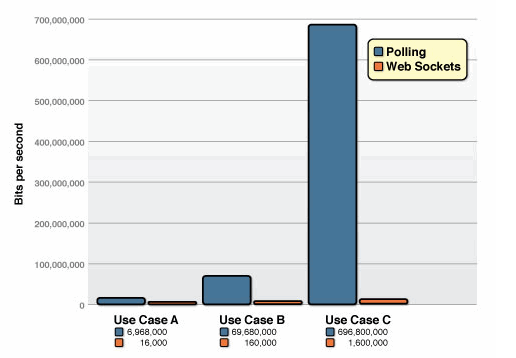
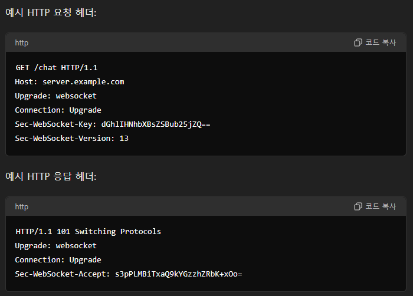
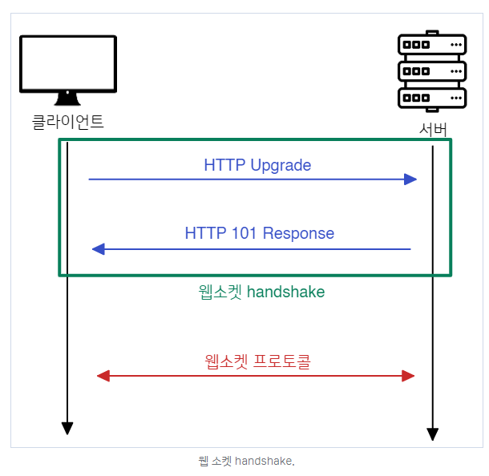
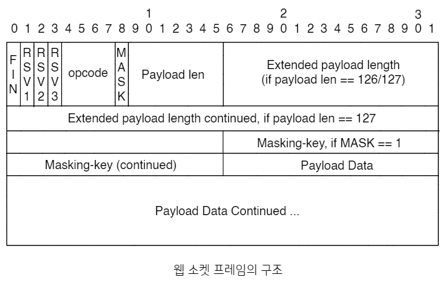
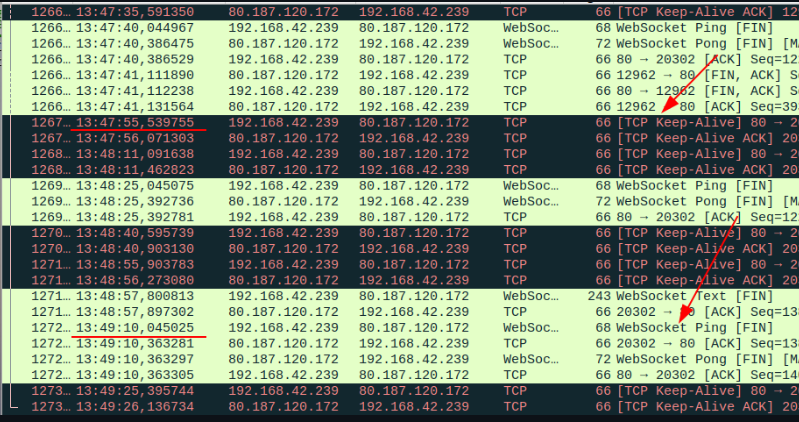

웹 소켓(WebSocket)이란 무엇이며, 언제 사용하나요?

---

# 웹소켓(WebSocket; WS)

- 웹 브라우저와 서버간의 통신 규약(프로토콜)
- 전이중(Full-Duplex) 통신
- 양방향 통신을 실시간으로 할 수 있음
- HTTP와는 달리 지속적인 연결을 유지

## 생성 배경

- 기존엔 폴링방식(주기적으로 요청을 날림)을 주로 사용했음
- 서버에서 새로운 데이터를 생성하지 않았을 때는 자원만 낭비하는 상황이 발생
- HTTP의 경우 매번 연결을 맺었다 끊어야 함 
- HTTP 헤더로 인한 오버헤드도 있음

### Polling vs Web Socket



- 기존의 HTTP 폴링 방식과 웹 소켓을 비교
- 하나의 HTTP 요청/응답의 경우 헤더 크기가 871 Byte
- 웹 소켓의 경우 하나의 메시지를 주고받는데 2 Byte

## 구성 요소

- 클라이언트
  - 웹소켓을 통해 서버와 통신하는 애플리케이션
  - 일반적으로 웹 브라우저
- 서버
  - 웹소켓을 통해 클라이언트와 통신하는 서버
- 웹소켓 핸드셰이크(WebSocket Handshake)
  - HTTP를 통해 초기 연결을 설정하는 과정
- 웹소켓 프레임(WebSocket Frames)
  - 데이터가 실시간으로 전송되는 방식

# 웹소켓 동작 원리

- TCP 3Way-Handshake로 HTTP 통신
- 연결된 후 WS 통신은 어플리케이션 계층에서 실행

## 웹 소켓 URI

- 웹 소켓 프로토콜에서 사용되는 URI
- 사실상 일반적인 URI와 동일

> ws(s)://호스트[:포트]/경로[?쿼리]

- scheme (required)
  - ws는 보안 연결을 사용하지 않는 경우 (https:// 유사)
  - wss는 보안 연결을 하는 경우 (http:// 유사)
- host (required)
  - 호스트 이름(도메인 이름)
- port (optional)
  - 명시적으로 지정하지 않는 경우, ws는 80번 포트, wss는 443번 포트가 사용됨
- 경로 (required)
  - 자원의 경로
- 쿼리 (optional)
  - 쿼리 파라미터

## 웹 소켓 동작 순서

1. HandShake 연결
   1. 클라이언트가 서버로 HTTP 요청
      - HTTP 요청 내에 Web Socket 프로토콜로 업그레이드 하는 Upgrade 헤더가 포함
   2. 서버가 요청 수락
   3. HTTP 헤더에 있는 UPGRADE 헤더 확인
   4. Web Socket 프로토콜로 업그레이드
2. 이후부터 Web Socket 연결이 성립
3. 클라이언트와 서버는 양방향으로 데이터 주고 받음
4. TCP 연결 단계에서 주기적으로 keep-alive 패킷으로 연결 확인
5. 웹소켓 단계에서는 ping pong 프로토콜로 연결 확인

***handshake 요청은 아래 규칙을 준수해야 합니다***

    1. HTTP 1.1 이상의 프로토콜을 준수하는 유효한 HTTP 요청
    2. 요청 메서드는 반드시 GET
    3. 요청에 반드시 HOST 헤더가 존재하고, 헤더값이 호스트이름 포함
    4. 요청에 반드시 Upgrade 헤더가 존재하고, 헤더값에 websocket이 반드시 포함
    5. 요청에 반드시 Connection 헤더가 존재하고, 헤더값에 Upgrade 포함
    6. 요청에 반드시 Sec-WebSocket-Version 헤더가 존재하고, 헤더값이 반드시 13
    7. 요청에 반드시 Sec-WebSocket-Key 헤더가 존재
    8. 클라이언트가 브라우저인 경우, Origin 헤더가 반드시 존재




## 웹 소켓의 구조



- FIN
  - 크기는 1Bit
  - 웹 소켓 메시지의 마지막 부분
- RSV1, RSV2, RSV3
  - 크기는 각각 1Bit
  - 웹 소켓 확장에서 0이 아닌 값에 대해 따로 정의를 하지 않은 경우 무조건 0
  - 정의하지 않은 0 이외의 값이 있다면 전송 받는 주체(클라이언트 혹은 서버)는 반드시 웹 소켓 연결을 끊어야 함
- Opcode
  - 크기는 4Bit
  - payload 해석 관련
  - 알 수 없는 opcode가 지정된 경우, 전송 받은 주체는 반드시 웹 소켓 연결을 끊어야 함
  - opcode의 값 종류
    - 0x0: 프레임이 이전 프레임과 이어짐
    - 0x1: payload 데이터가 UTF-8 인코딩 텍스트 형식
    - 0x2: payload 데이터가 바이너리 형식
    - 0x3 ~ 0x7: 프로토콜에 차후 추가될 non-control 프레임을 위해 예약된 코드
    - 0x8: 연결 종료 (Close 프레임)
    - 0x9: “ping” 신호
    - 0xA: “pong” 신호
    - 0xB ~ 0xF: 프로토콜에 차후 추가될 non-control 프레임을 위해 예약된 코드
- MASK
  - 크기는 1Bit
  - payload의 마스킹 여부
  - 값이 1이며 unmasking에 사용될 마스킹 key값이 masking-key에 저장
- Payload length
  - 크기는 유동적
  - payload의 바이트 크기
- Masking-key
  - 크기는 32Bit
  - 클라이언트에서 서버로 전송될 때 사용된 key
  - 모든 프레임은 마스킹됨 
- Payload data
  - 클라이언트와 서버가 실제 주고받는 데이터

---

## **질문사항**

### *Q1. http 통신 전에 ws 통신을 시도를 하면 어떻게 되는가?*

```
최초에 HTTP 연결 전에는 서버는 HTTP 프로토콜로 대기하므로 ws로 오는 내용이 무엇인지 모름 
웹소켓은 서버가 수락한 이후에 사용 가능
```

### *Q2. 웹소켓의 세션 관리, tcp 의 세션관리*

```
TCP 레벨의 Keep-Alive

- TCP Keep-Alive는 일정 시간 동안 데이터가 오가지 않으면, 연결이 여전히 유효한지 확인하기 위해 작은 패킷을 주기적으로 보내는 기능
- 웹소켓은 기본적으로 TCP 연결 위에서 동작
- TCP의 Keep-Alive 기능을 통해 네트워크 레벨에서 연결 상태를 관리

Application 레벨의 Ping-Pong

- 웹소켓 프로토콜 자체는 어플리케이션 레벨에서 연결 상태를 확인하고 유지하기 위해 Ping-Pong 프레임을 정의 
- 클라이언트나 서버는 특정 주기마다 Ping 프레임을 전송하고 상대방은 응답값인 Pong 프레임을 전송 
- 만약 일정 시간 내에 Pong 응답이 오지 않으면, 연결이 끊긴 것으로 간주하고 재연결을 시도
```



### *Q3. 웹소켓에서 마스킹의 역할은?*

```
암호화 보다는 난독화의 느낌이 강한 방법
데이터가 중간에 수정이 되는것을 방지하고 분석하기 어렵게 하는데 의의
클라이언트에서 서버로 보내는 메시지는 마스킹
서버에서 클라이언트로 보내는 메시지는 마스킹되지 않음(평문 데이터)
```
