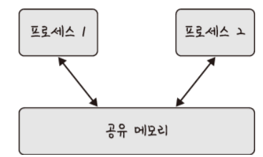

컨텍스트 스위칭에 대해 설명해보세요.

---

# 컨텍스트 스위칭 (Context Swiching)

- 컨텍스트 스위칭은 PCB를 기반으로 프로세스의 상태를 저장하고 로드시키는 과정
- 한 프로세스에 할당된 시간이 끝나거나 인터럽트에 의해 발생
- 컴퓨터는 많은 프로그램을 동시에 실행하는 것처럼 보이지만 특정 시점에서 실행되고 있는 프로세스는 단 한 개임
- 많은 프로세스가 동시에 구동 되는 것처럼 보이는 것은 다른 프로세스와의 컨텍스트 스위칭이 아주 빠른 속도로 실행되기 때문
- 현대에는 컴퓨터가 멀티코어 CPU를 가지므로 한 시점에 한 개의 프로그램이라는 설명은 틀린 설명임
- 하지만, 컨텍스트 스위칭을 설명할 때는 싱글코어 기준으로 설명할 예정

## 싱글 코어에서 컨텍스트 스위칭

- 프로세스 A가 실행하다 멈추고, 프로세스 A의 PCB를 저장하고 다시 프로세스 B를 로드하여 실행
- 다시 프로세스 B의 PCB를 저장하고 프로세스 A의 PCB를 로드 후 실행
- 컨텍스트 스위칭이 일어날 때는 유휴 시간(Idle Time)이 발생
- 뿐만 아니라 캐시미스라는 스위칭 비용이 더 듦

### 유휴 시간(Idle Time)

- 컨텍스트 스위칭 중 CPU가 현재 프로세스 상태를 저장하고 다음 프로세스의 상태를 복원하는 작업
- 프로세스 실행하는 것이 아닌 운영체제의 내부 작업을 수행
- 사용자 입장에서는 아무 작업도 하지 않는 것처럼 보이기 때문에 유휴 시간이라고 함

### 캐시미스(Cache Miss)

- 컨텍스트 스위칭으로 필요한 데이터가 캐시에 없어 메모리에서 가져오는 현상
- CPU 성능 향상을 위해 자주 사용하는 데이터를 캐시에 저장
- 컨텍스트 스위칭이 발생할 때 잘못된 주소 변환을 방지하기 위해 캐시 클리어 과정을 함께 실행
- 컨텍스트 스위칭이 자주 발생할 수록 캐시 미스로 인해 메모리 접근 시간을 증가시켜 전체 시스템의 성능 저하를 초래 

## 스레드에서의 컨텍스트 스위칭

- 컨텍스트 스위칭은 스레드에서도 발생
- 스레드는 스택 영역을 제외한 모든 메모리를 공유하므로 컨텍스트 스위칭 비용이 더 적음
- 즉, 시간이 적게 걸림

# PCB (Process Control Block)

- 프로세스를 관리하기 위해 사용하는 데이터 구조
- 즉, 프로세스의 메타데이터(PID, Status, 명령어 주소, 메모리 정보, 스케쥴링 등)를 저장하는 데이터
- 프로세스의 중요 정보를 포함하기 때문에 일반 사용자가 접근하지 못하도록 커널 스택의 가장 앞부분에서 관리
- 프로세스 제어 블록이라고도 말함
- 프로그램이 실행되면 프로세스가 생성되고 운영체제가 PCB를 생성하여 프로세스에 PCB를 할당함

> ### **메타데이터(Meta Data)**
> - 데이터를 설명하는 작은 데이터들이 구조화된 데이터
> - 대량의 정보 가운데 찾고자 하는 정보를 효율적으로 찾기 위해 일정한 규칙 부여되는 데이터

## PCB 구조

- 프로세스 ID (PID)
  - 자신의 프로세스 ID와 자식 프로세스 ID
- 프로세스 상태
  - '준비', '일시중단' 등 프로세스가 CPU에 대한 소유권을 얻은 이후의 현재 상태 정보
- 프로세스 권한
  - 컴퓨터 자원 또는 I/O 디바이스에 대한 권한 정보
- 프로그램 카운터
  - 프로세스에서 실행해야 할 다음 명령어의 주소에 대한 포인터
- CPU 레지스터
  - 프로세스를 실행하기 위해 저장해야 할 레지스터에 대한 정보
  - 프로세스가 CPU를 사용하다가 중단되면 다시 이어서 할 수 있음
- 메모리 정보
  - 프로세스가 사용하는 메모리 번위, 페이지 테이블 등
- I/O 상태 정보
  - 프로세스에 할당된 I/O 디바이스 목록
- CPU 스케줄링 정보
  - CPU 스케줄러에 의해 중단된 시간 등에 대한 정보
- 계정 정보
  - 프로세스 실행에 사용된 CPU 사용량, 실행한 유저의 정보

# 멀티프로세싱

- 여러 개의 프로세스, 즉, 멀티프로세스를 통해 동시에 두 가지 이상의 일을 수행
- 하나 이상의 일을 병렬로 처리할 수 있음
- 특정 프로세스에 메모리 또는 프로세스 일부에 문제가 발생되더라도 다른 프로세스를 이용해서 처리할 수 있음
- 다른 프로세스의 영향을 받지 않으므로 안정성과 신뢰성이 높음
- 하드웨어 관점에서 멀티프로세싱은 여러 개의 프로세스로 작업을 처리하는 것임
- 소프트웨어 관점에서 멀티프로세싱은 ?

## 예제: 웹 브라우저

- 웹 브라우저는 멀티프로세스 구조를 가짐
- 브라우저 프로세스
  - 주소 표시줄, 북마크 막대, 뒤로 가기 버튼, 앞으로 가기 버튼 등을 담당
  - 네트워크 요청이나 파일 접근 같은 권한을 담당
- 렌더러 프로세스
  - 웹 사이트가 ‘보이는’ 부분의 모든 것을 제어
- 플러그인 프로세스
  - 웹 사이트에서 사용하는 플러그인을 제어
- GPU 프로세스
  - GPU를 이용해서 화면을 그리는 부분을 제어

## IPC

- 멀티프로세스는 IPC(Inter Process Communication)가 가능
- IPC는 프로세스끼리 데이터를 주고받고 공유 데이터를 관리하는 메커니즘
- IPC 예시로 클라이언트는 데이터를 요청하고 서버는 클라이언트 요청에 응답하는 구조(클라이언트/서버)가 있음
- IPC 종류로는 공유 메모리, 파일, 소켓, 익명 파이프, 명명 파이프, 메세지 큐가 있음
- 메모리가 완전히 공유되는 스레드보다는 속도가 떨어짐

### 공유 메모리(Shared Memory)

- 공유 메모리를 사용하면 프로세스 간 통신 가능
- 즉, 여러 프로세스가 동일한 메모리 블록에 접근 권한이 부여되고 동일 메모리를 접근하는 프로세스는 서로 통신 가능
- 기본적으로는 각 프로세스의 메모리는 다른 프로세스가 접근할 수 없음
- 공유 메모리는 여러 프로세스가 하나의 메모리를 공유할 수 있음
- IPC 방식 중 매개체를 통해 데이터를 주고받는 것이 아닌 메모리 자체를 공유
- 오버헤드(불필요한 데이터 복사)가 발생하지 않아 IPC 중 가장 빠름
- 같은 메모리 영역을 여러 프로세스가 공유하기 때문에 동기화가 필요
- 참고로 하드웨어 관점에서 공유 메모리는 CPU가 접근할 수 있는 큰 랜덤 접근 메모리인 RAM을 가리킴

### 파일

- 디스크에 저장된 데이터
- 파일 서버에서 제공한 데이터
- 파일 기반으로 프로세스 간 통신

### 소켓

- 동일 시스템 내 다른 프로세스 또는 네트워크 내 다른 프로세스로 데이터 전송
- 네트워크 인터페이스를 통해 전송
- TCP와 UDP가 있음

### 익명 파이프(Unnamed Pipe)

- 프로세스 간에 FIFO 방식으로 읽히는 임시 공간인 파이프를 기반으로 데이터를 주고 받음
- 단방향 방식의 읽기 전용, 쓰기 전용 파이프를 만들어서 작동
- 부모, 자식 프로세스 간에만 사용할 수 있음
- 다른 네트워크 상에서 사용 불가능

### 명명된 파이프(Named Pipe)

- 파이프 서버와 하나 이상의 파이프 클라리언트 간의 통신
- 명명된 단방향 또는 양방향 파이프
- 클라이언트/서버 통신을 위한 별도의 파이프를 제공
- 여러 파이프를 동시에 사용 가능
- 시스템 내 프로세스끼리 또는 다른 네트워크상의 컴퓨터와도 통신 가능
- 보통 서버용 파이프와 클라이언트용 파이프로 구분해서 작동
- 하나의 인스턴스를 열거나 여러 개의 인스턴스를 기반으로 통신

### 메세지 큐(Message Queue)

- 메세지를 큐(Queue) 데이터 구조 형태로 관리
- 커널의 전역변수 형태 등 커널에서 전역적으로 관리
- 다른 IPC 방식에 비해서 사용 방법이 매우 직관적이고 간단
- 다른 코드의 수정 없이 단지 몇 줄의 코드를 추가시켜 간단하게 메세지 큐에 접근할 수 있음 
- I/O 빈도가 높으면 동기화 구현이 어려워지므로 공유 메모리 대신 메세지 큐 사용
