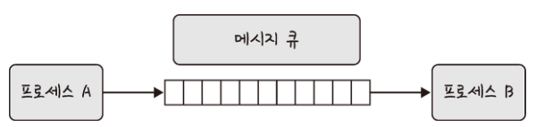

멀티프로세스와 멀티스레드에 대해 설명해보세요.

---

# 멀티프로세스(Multi-Process)

- 하나의 프로그램이 여러 개의 독립된 프로세스를 생성하여 병렬 작업 수행
- 메모리를 공유하지 않아 프로세스 간 영향이 없어 안정성과 신뢰성이 높음
- 하드웨어 관점에서는 여러 개의 프로세스로 작업을 처리함

## 멀티프로세스 특징

- 독립성
  - 독립된 메모리 공간을 가짐
  - 다른 프로세스와 메모리르 공유하지 않음
- 안정성
  - 한 프로세스에 문제가 발생해도 다른 프로세스에 영향을 주지 않음
- 자원 소모
  - 프로세스 간 메모리 공유가 없어 메모리 사용량이 상대적으로 많음
  - 각각의 프로세스를 실행하기 위해 컨텍스트 스위칭일 필요
  - 컨텍스트 스위칭 비용이 높아 성능 저하가 발생할 수 있음
- 통신 방식
  - 프로세스 간 통신(IPC)를 위해 소켓, 파이프 공유 메모리 등의 메커니즘을 사용

## 예제: 웹 브라우저

- 웹 브라우저는 멀티프로세스 구조를 가짐
- 브라우저 프로세스
  - 주소 표시줄, 북마크 막대, 뒤로 가기 버튼, 앞으로 가기 버튼 등을 담당
  - 네트워크 요청이나 파일 접근 같은 권한을 담당
- 렌더러 프로세스
  - 웹 사이트가 ‘보이는’ 부분의 모든 것을 제어
- 플러그인 프로세스
  - 웹 사이트에서 사용하는 플러그인을 제어
- GPU 프로세스
  - GPU를 이용해서 화면을 그리는 부분을 제어

## IPC

- 멀티프로세스는 IPC(Inter Process Communication)가 가능
- IPC는 프로세스끼리 데이터를 주고받고 공유 데이터를 관리하는 메커니즘
- IPC 예시로 클라이언트는 데이터를 요청하고 서버는 클라이언트 요청에 응답하는 구조(클라이언트/서버)가 있음
- IPC 종류로는 공유 메모리, 파일, 소켓, 익명 파이프, 명명 파이프, 메세지 큐가 있음
- 메모리가 완전히 공유되는 스레드보다는 속도가 떨어짐

### 공유 메모리(Shared Memory)

- 공유 메모리를 사용하면 프로세스 간 통신 가능
- 즉, 여러 프로세스가 동일한 메모리 블록에 접근 권한이 부여되고 동일 메모리를 접근하는 프로세스는 서로 통신 가능
- 기본적으로는 각 프로세스의 메모리는 다른 프로세스가 접근할 수 없음
- 공유 메모리는 여러 프로세스가 하나의 메모리를 공유할 수 있음
- IPC 방식 중 매개체를 통해 데이터를 주고받는 것이 아닌 메모리 자체를 공유
- 오버헤드(불필요한 데이터 복사)가 발생하지 않아 IPC 중 가장 빠름
- 같은 메모리 영역을 여러 프로세스가 공유하기 때문에 동기화가 필요
- 참고로 하드웨어 관점에서 공유 메모리는 CPU가 접근할 수 있는 큰 랜덤 접근 메모리인 RAM을 가리킴

### 파일

- 디스크에 저장된 데이터
- 파일 서버에서 제공한 데이터
- 파일 기반으로 프로세스 간 통신

### 소켓

- 동일 시스템 내 다른 프로세스 또는 네트워크 내 다른 프로세스로 데이터 전송
- 네트워크 인터페이스를 통해 전송
- TCP와 UDP가 있음

### 익명 파이프(Unnamed Pipe)

- 프로세스 간에 FIFO 방식으로 읽히는 임시 공간인 파이프를 기반으로 데이터를 주고 받음
- 단방향 방식의 읽기 전용, 쓰기 전용 파이프를 만들어서 작동
- 부모, 자식 프로세스 간에만 사용할 수 있음
- 다른 네트워크 상에서 사용 불가능

### 명명된 파이프(Named Pipe)

- 파이프 서버와 하나 이상의 파이프 클라리언트 간의 통신
- 명명된 단방향 또는 양방향 파이프
- 클라이언트/서버 통신을 위한 별도의 파이프를 제공
- 여러 파이프를 동시에 사용 가능
- 시스템 내 프로세스끼리 또는 다른 네트워크상의 컴퓨터와도 통신 가능
- 보통 서버용 파이프와 클라이언트용 파이프로 구분해서 작동
- 하나의 인스턴스를 열거나 여러 개의 인스턴스를 기반으로 통신

### 메세지 큐(Message Queue)

- 메세지를 큐(Queue) 데이터 구조 형태로 관리
- 커널의 전역변수 형태 등 커널에서 전역적으로 관리
- 다른 IPC 방식에 비해서 사용 방법이 매우 직관적이고 간단
- 다른 코드의 수정 없이 단지 몇 줄의 코드를 추가시켜 간단하게 메세지 큐에 접근할 수 있음 
- I/O 빈도가 높으면 동기화 구현이 어려워지므로 공유 메모리 대신 메세지 큐 사용

# 멀티스레드(Multi-Thread)

- 하나의 프로세스 내에서 여러 개의 스레드를 생성하여 병렬 작업 수행
- 한 스레드가 중단(Blocked)되어도 다른 스레드는 실행(Running) 가능하여 빠른 처리가 가능
- 문제가 발생하면 다른 스레드도 영향을 받아 스레드로 이루어진 프로세스에 영향을 줄 수 있음
- 독립적인 작업들을 작은 단위로 나눠 동시에 실행(동시성)되는 것처럼 보여줌

## 멀티스레드 특징

- 공유 메모리
  - 스레드들은 코드, 데이터, 힙 영역을 공유
  - 스택은 개별적으로 가짐
- 경량성
  - 스레드는 프로세스보다 생성 및 종료 비용이 적음
  - 컨텍스트 스위칭 비용도 낮음
- 통신 용이성
  - 공유 메모리를 통해 스레드 간 통신 가능

## 예제: 웹 브라우저 렌더러 프로세스(Rendering)

- 렌더러 프로세스는 브라우저의 각 탭에서 웹 콘텐츠를 처리하는 독립적인 프로세스
- HTML, CSS, JavaScript를 해성하여 웹페이지를 생성
- 렌더링은 여러 스레드로 구성되어 있음
  - Main Thread
    - HTML 파싱, DOM 및 CSSOM 생성, JavaScript 실행 등 대부분의 작업
  - Compositor Thread
    - 레이어를 조합하여 최종 화면을 구성하는 작업
  - Raster Thread
    - 컴포지터 스레드에서 전달받은 정보를 바탕으로 실제 픽셀 데이터를 생성
  - Worker Thread
    - 웹 워커나 서비스 워커를 통해 백그라운드에서 JavaScript를 실행하여 메인 스레드의 부하를 줄임
- 웹 요청을 처리할 때도 스레드를 사용하면 적은 리소스를 소비하여 작업 가능

### 렌더링의 장점

- 성능 향상
  - 작업을 병렬 처리하여 페이지 로딩 속도를 개선
- 안정성 증가
  - 한 스레드에 문제가 발생해도 다른 스레드에 영향을 주지 않음
  - 전체 프로세스의 안정성 유지
- 부드러운 사용자 경험
  - 스크롤, 애니메이션과 같은 시각적 효과를 매끄럽게 처리

# 멀티프로세스 vs 멀티스레드

| 항목       | 멀티프로세스      | 멀티스레드               |
|----------|-------------|---------------------|
| 메모리 공간   | 프로세스마다 독립적  | 스레드 간 공유            |
| 안정성      | 높음 안정성      | 낮은 안정성              |
| 자원 소모    | 상대적으로 많음    | 상대적으로 적음            |
| 통신 방식    | IPC 메커니즘 필요 | 공유 메모리를 통한 직접 통신 가능 |
| 컨텍스트 스위칭 | 비용이 높음      | 비용이 낮음              |
| 개발 복잡도   | 상대적으로 낮음    | 동기화 등으로 인해 높음       |

## 각각의 예제

