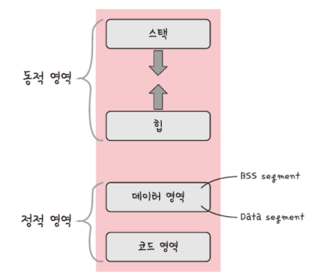
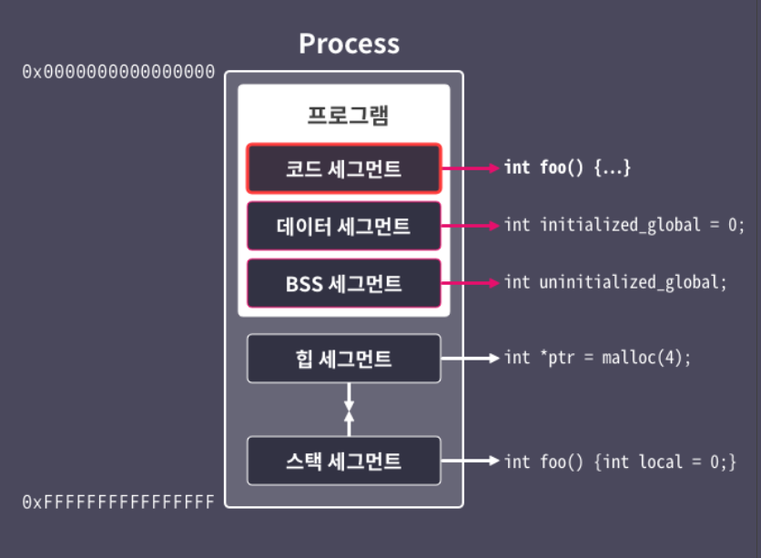
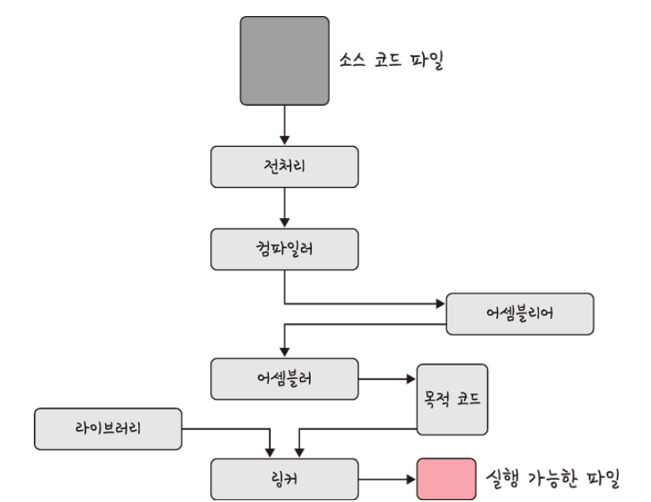

프로세스에 대해 설명해주세요.

---

# 프로세스

- 컴퓨터에서 실행되고 있는 프로그램
- CPU 스케줄링의 대상이 되는 작업(task)이라는 용어와 거의 같은 의미


- 프로그램이 메모리에 올라가면 프로세스가 됨(인스턴스화)
- 이후 운영체제의 CPU 스케줄러에 따라 CPU 프로세스를 실행

> ### **스레드**  
> - 프로세스 내 작업 흐름

## 프로세스의 상태

- 프로세스의 상태는 여러 가지 상태 값을 가짐


### 생성 상태

- 프로세스가 생성된다는 의미
- <code>fork()</code> 또는 <code>exec()</code> 함수를 통해 생성
- 프로세스가 생성될 때 PCB (Process Control Block)가 할당됨
- <code>fork()</code>
  - 부모 프로세스의 주소 공간을 그대로 복사하여 새로운 자식 프로세스를 생성하는 함수
  - 주소 공간만 복사할 뿐이지 부모 프로세스의 비동기 작업 등을 상속하지 않음
- <code>exec()</code>
  - 새롭게 프로세스를 생성하는 함수
- 크롬을 처음 실행할 때는 <code>exec()</code> 실행, 새로운 탭을 실행할 때는 <code>fork()</code> 실행

### 대기 상태

- CPU 스케줄러로부터 CPU 소유권이 넘어오기를 기다리는 상태
- 입출력 대기 상태와 자원 대기 상태가 있음
  - 입출력 대기: 하드디스크 또는 네트워크 등의 외부 장치에서 데이터를 받기 위해 기다리는 상태
  - 자원 대기: CPU나 다른 시스템 자원을 기다리는 상태
- 메모리 공간이 충분하면 메모리를 할당 받음
- 메모리 공간이 부족하면 메모리를 할당 받지 못한 상태로 대기 

### 대기 중단 상태

- 메모리 부족으로 일시 중단된 상태
- 예를 들어 입출력을 기다리는 대기 상태에서 운영체제가 메모리에서 내린 상황
- 즉, 입출력도 안 끝났고 메모리에도 없음

### 실행 상태

- CPU 소유권과 메모리를 할당받고 인스트럭션(Instruction)을 수행 중인 상태를 의미 
- 인스트럭션을 CPU Burst가 일어났다고 표현

> ### **Instruction (인스트럭션; 명령어)**
> - 컴퓨터가 수행할 특정 작업을 정의하는 명령
> - 명령어는 컴퓨터 프로그램을 구성하는 기본 단위
> - 명령어가 수행되면 CPU가 해석하고 실행하여 다양한 연산을 수행
> - 컴퓨터 시스템에서 명령어는 주로 기계어(machine language) 또는 어셈블리어(assembly language)로 표현

> ### **CPU Burst**
> - CPU가 연속적으로 인스트럭션을 수행하는 기간 
> - CPU Burst 동안 프로세스는 CPU에 의해 스케줄링되어 계속해서 인스트럭션을 실행

### 중단 상태

- 중단 상태는 어떤 이벤트가 발생한 이후 기다리며 프로세스가 차단된 상태
- I/O 디바이스에 의한 인터럽트로 이런 현상이 많이 발생 
- 예를 들어 프린트 인쇄 버튼을 눌렸을 때 프로세스가 잠깐 멈춘 듯한 현상이 있음

### 일시 중단 상태

- 일시 중단 상태는 대기 중단과 유사 
- 중단 상태에서 프로세스가 실행되려고 했지만 운영체제가 강제로 잠깐 멈춘 상태
- 메모리 부족, 프로세스 우선순위 조정 등의 시스템적인 이유가 있음

### 종료 상태

- 종료 상태는 메모리와 CPU 소유권을 모두 놓고 가는 상태
- 종료는 자연스럽게 종료되는 것도 있지만 부모 프로세스가 자식 프로세스를 강제시키는 비자발적 종료(abort)로 종료되는 것도 있음
  - 자식 프로세스에 할당된 자원의 한계치를 넘어서는 경우
  - 부모프로세스가 종료되는 경우
  - 사용자가 process.kill 등의 명령어로 프로세스를 종료하는 경우

## 프로세스의 메모리 구조



<pre>
|-----------------------| ← 높은 주소
|       스택(Stack)      |
|-----------------------|
|                       |
|         여유 공간      |
|                       |
|-----------------------|
|        힙(Heap)       |
|-----------------------|
|   데이터(Data) 영역    |
|-----------------------|
|   코드(Code) 영역      |
|-----------------------| ← 낮은 주소
</pre>

- 운영체제는 프로세스에 적절한 메모리를 할당
- 메모리는 스택, 힙, 데이터 영역, 코드 영역으로 나뉨
- 할당 방향과 용도가 달라 메모리 관리와 효율성 측면이 달라짐

### 스택과 힙

- 프로그램이 실행될 때 사용하는 메모리 영역
- 동적 할당되는 영역
- 스택은 메모리의 높은 주소부터 할당되고 힙은 메모리의 낮은 주소부터 할당
- 메모리 공간의 효율적인 사용과 충돌 방지를 위해 서로 반대 방향으로 메모리 할당
- 중간 영역이 서로 침범하지 않도록 관리가 필요
- 서로의 영역을 침범하면 스택 오버플로우(Stack Overflow)나 힙 오버플로우(Heap Overflow)와 같은 문제가 발생

> ### **동적 할당**
> - 런타임 단계에서 메모리를 할당받는 것을 말함

### 스택

- LIFO(Last-In, First-Out) 구조를 따름
- 실행되는 함수에 의해 늘어들거나 줄어드는 메모리 영역
- 지역 변수, 매개변수 저장에 사용 
- 함수가 호출될 때마다 호출하는 환경 등의 정보가 스택에 계속해서 저장
- 재귀 함수가 호출되면 새로운 스택 프레임이 매번 생성되어 해당 함수의 변수 집합이 다른 변수를 방해하지 않음
- 함수가 종료되면 자동으로 할당 해제되어 할당과 해제가 빠름
- 메모리 관리가 자동으로 이뤄짐

### 힙

- 동적으로 할당되는 변수들을 메모리 저장에 사용
- 프로그래머가 명시적으로 메모리를 할당하고 해제해야 함
- <code>malloc()</code>, <code>free()</code> 함수를 통해 관리됨
- vector는 내부적으로 힙 영역을 사용
- 할당과 해제가 스택보다 느림
- 메모리 누수의 위험이 있음

#### <code>malloc()</code>

- C 언어의 함수로 메모리가 필요한 경우 호출
- 힙은 최소 Byte 크기를 갖는 메모리 블록의 포인터를 리턴
- 32 비트 모드에서는 malloc은 주소가 항상 8의 배수인 블록을 리턴
- 64 비트 모드에서는 항상 16의 배수인 블록을 리턴
- 프로그램이 가용한 가상 메모리보다 더 큰 크기의 메모리 블록을 요청하는 등의 문제가 생긴다면 malloc은 NULL을 리턴
- malloc 함수를 호출한 다음에는 반드시 NULL 체크를 해줘야 함

```c 
#include <stdlib.h>

void *malloc(size_t size);

// Returns pointer to allocated block if OK
// NULL on Error
````  
    
#### free()

- C 언어에서 malloc 등의 함수로 할당된 힙 블록을 free 함수를 호출해서 반환
- ptr 인자는 할당받은 메모리 블록의 시작 지점을 가리켜야 함
- 메모리 영역이 엉뚱한 곳에서 해제되면, 더 이상 유효한 메모리 주소를 가리키지 않는 dangling 포인터를 만들게 됨
- free 함수를 사용할 때에는 반드시 알맞은 포인터를 해제하도록 유의해야 함

```c
#include <stdlib.h>

void free(void *ptr);

// Returns: nothing
```

### 데이터 영역과 코드 영역

- 정적 할당되는 영역

> ### **정적 할당**
> - 컴파일 단계에서 메모리를 할당받는 것을 말함

### 데이터 영역

- BSS(Block Started by Symbol) Segement와 Data Segement 있음

#### BSS(Block Started by Symbol) Segement

- 0으로 초기화 또는 초기값이 명시되지 않은 전역 변수와 정적 변수가 저장되는 메모리 영역
- 프로그램 시작 시 해당 영역은 운영체제에 의해 자동으로 0으로 초기화
- 실행 파일에는 해당 변수들의 크기 정보만 저장되며 실제 데이터는 포함되지 않아 파일 크기를 줄일 수 있음

```c
int uninitialized_global;         // 전역 변수
static int uninitialized_static;  // 정적 변수
```

``` ptyhon
# 전역 변수 (BSS Segment와 Data Segment에 해당)
bss_segment_전역 = 0    # 초기화되지 않은 전역 변수 (BSS Segment에 해당)
data_segment_전역 = 10  # 초기화된 전역 변수 (Data Segment에 해당)

def example_function():
    # 함수 내 지역 변수 (스택에 저장)
    지역 = 5

# 함수 정의 (Code/Text Segment에 해당)
example_function()
```

#### Data Segement

- 0이 아닌 초기값이 명시된 전역 변수와 정적 변수가 저장되는 메모리 영역
- 프로그램 시작 시 초기값이 저장된 ROM에서 RAM으로 복사되어 실행 중에 사용
- 읽기/쓰기 권한이 있어 변수의 값 변경이 가능

```c
int initialized_global = 10;        // 전역 변수
static int initialized_static = 5;  // 정적 변수 
```

### 코드 영역(Code Segement)

- 프로그램의 코드가 저장됨
- Text Segement라고도 불림
- 프로그램의 실행 가능한 명령어(기계어 코드)가 저장되는 영역
- 함수, 조건문 등 컴파일된 기계어 명령어가 포함
- 프로그램이 실행될 때 운영체제는 코드 영역에 저장된 명령어를 CPU에 전달
- 일반적으로 읽기, 실행 권한만 부여되고 쓰기 권한은 제거되어 있음
- 쓰기 권한이 제거됨으로서 악의적인 코드 삽입을 방지하고 버퍼 오버플로우 등의 보안 취약점을 예방

```c
int main() { return 0; }
```



# 프로그램의 컴파일과정



1. 전처리
  - 소스 코드의 주석을 제거
  - #include 등 헤더 파일을 병합하여 매크로를 치환
2. 컴파일러
  - 오류 처리, 코드 최적화 작업
  - 어셈블리어로 변환
3. 어셈블러
  - 어셈블리어가 목적 코드로 변환 
  - 확장자는 운영체제마다 다름
    - 리눅스에서는 <code>*.o</code> 
  - 예를 들어 <code>file.c</code>라는 파일은 <code>file.o</code>로 변환
4. 링커
  - 프로그램 내에 있는 라이브러리 함수 또는 다른 파일들과 목적 코드를 결합하여 실행 파일을 만듦 
  - 실행 파일 확장자는 .exe 또는 .out이 있음
  - 라이브러리 사용방식에는 정적/동적이 있음
    - 정적 라이브러리
      - 프로그램 빌드 시 라이브러리가 제공하는 모든 코드를 실행 파일에 넣는 방식
      - 장점으로 시스템 환경 등 외부 의존도가 낮음
      - 단점으로 코드 중복 등 메모리 효율성이 떨어짐
    - 동적 라이브러리
      - 프로그램 실행 시 필요할 때만 DLL이라는 함수 정보를 통해 참조하여 라이브러리를 쓰는 방법
      - 장점으로 메모리 효율성이 높음
      - 단점으로 외부 의존도가 높아짐

---

## **질문사항**

### *Q1. 인스트럭션 예시를 알려주세요*

```python
a = 10
b = 20
c = a + b
print(c)
```

```
위와 같이 파이썬 연산이 있을경우 CPU는 다음과 같은 인스트럭션을 처리

1. 변수 a와 b에 값을 할당: 명령어로 10과 20을 변수 a와 b에 할당
2. a와 b의 값을 더하는 연산: ADD 명령어로 변수 a와 b의 값을 더하여 변수 c에 저장
3. 결과를 출력: PRINT 명령어 변수 c의 값을 출력

위와 같은 행위들을 수행하기 위해 CPU에 내리는 명령을 인스터력션이라고 함
```
