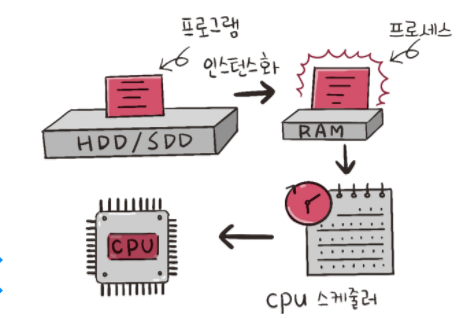
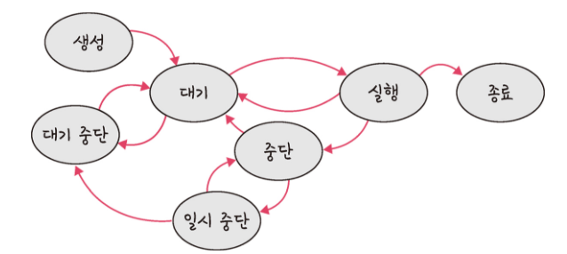
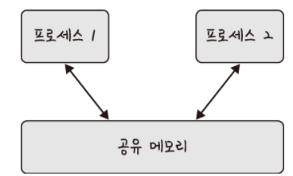
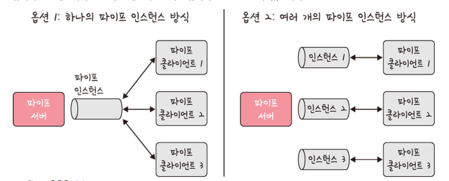
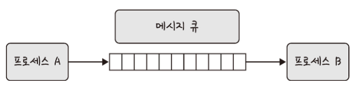

프로세스에 대해 설명해주세요.

---

# 프로세스

- 컴퓨터에서 실행되고 있는 프로그램
- CPU 스케줄링의 대상이 되는 작업(task)이라는 용어와 거의 같은 의미



- 프로그램이 메모리에 올라가면 프로세스가 됨(인스턴스화)
- 이후 운영체제의 CPU 스케줄러에 따라 CPU 프로세스를 실행

> ### **스레드**  
> - 프로세스 내 작업 흐름

## 프로세스의 상태

- 프로세스의 상태는 여러 가지 상태 값을 가짐



### 생성 상태

- 프로세스가 생성된다는 의미
- <code>fork()</code> 또는 <code>exec()</code> 함수를 통해 생성
- 프로세스가 생성될 때 PCB (Process Control Block)가 할당됨
- <code>fork()</code>
  - 부모 프로세스의 주소 공간을 그대로 복사하여 새로운 자식 프로세스를 생성하는 함수
  - 주소 공간만 복사할 뿐이지 부모 프로세스의 비동기 작업 등을 상속하지 않음
- <code>exec()</code>
  - 새롭게 프로세스를 생성하는 함수
- 크롬을 처음 실행할 때는 <code>exec()</code> 실행, 새로운 탭을 실행할 때는 <code>fork()</code> 실행

### 대기 상태

- CPU 스케줄러로부터 CPU 소유권이 넘어오기를 기다리는 상태
- 입출력 대기 상태와 자원 대기 상태가 있음
  - 입출력 대기: 하드디스크 또는 네트워크 등의 외부 장치에서 데이터를 받기 위해 기다리는 상태
  - 자원 대기: CPU나 다른 시스템 자원을 기다리는 상태
- 메모리 공간이 충분하면 메모리를 할당 받음
- 메모리 공간이 부족하면 메모리를 할당 받지 못한 상태로 대기 

### 대기 중단 상태

- 메모리 부족으로 일시 중단된 상태
- 예를 들어 입출력을 기다리는 대기 상태에서 운영체제가 메모리에서 내린 상황
- 즉, 입출력도 안 끝났고 메모리에도 없음

### 실행 상태

- CPU 소유권과 메모리를 할당받고 인스트럭션(Instruction)을 수행 중인 상태를 의미 
- 인스트럭션을 CPU Burst가 일어났다고 표현

> ### **Instruction (인스트럭션; 명령어)**
> - 컴퓨터가 수행할 특정 작업을 정의하는 명령
> - 명령어는 컴퓨터 프로그램을 구성하는 기본 단위
> - 명령어가 수행되면 CPU가 해석하고 실행하여 다양한 연산을 수행
> - 컴퓨터 시스템에서 명령어는 주로 기계어(machine language) 또는 어셈블리어(assembly language)로 표현

> ### **CPU Burst**
> - CPU가 연속적으로 인스트럭션을 수행하는 기간 
> - CPU Burst 동안 프로세스는 CPU에 의해 스케줄링되어 계속해서 인스트럭션을 실행

### 중단 상태

- 중단 상태는 어떤 이벤트가 발생한 이후 기다리며 프로세스가 차단된 상태
- I/O 디바이스에 의한 인터럽트로 이런 현상이 많이 발생 
- 예를 들어 프린트 인쇄 버튼을 눌렸을 때 프로세스가 잠깐 멈춘 듯한 현상이 있음

### 일시 중단 상태

- 일시 중단 상태는 대기 중단과 유사 
- 중단 상태에서 프로세스가 실행되려고 했지만 운영체제가 강제로 잠깐 멈춘 상태
- 메모리 부족, 프로세스 우선순위 조정 등의 시스템적인 이유가 있음

### 종료 상태

- 종료 상태는 메모리와 CPU 소유권을 모두 놓고 가는 상태
- 종료는 자연스럽게 종료되는 것도 있지만 부모 프로세스가 자식 프로세스를 강제시키는 비자발적 종료(abort)로 종료되는 것도 있음
  - 자식 프로세스에 할당된 자원의 한계치를 넘어서는 경우
  - 부모프로세스가 종료되는 경우
  - 사용자가 process.kill 등의 명령어로 프로세스를 종료하는 경우

# PCB (Process Control Block)

- 프로세스를 관리하기 위해 사용하는 데이터 구조
- 즉, 프로세스의 메타데이터(PID, Status, 명령어 주소, 메모리 정보, 스케쥴링 등)를 저장하는 데이터
- 프로세스의 중요 정보를 포함하기 때문에 일반 사용자가 접근하지 못하도록 커널 스택의 가장 앞부분에서 관리
- 프로세스 제어 블록이라고도 말함
- 프로그램이 실행되면 프로세스가 생성되고 운영체제가 PCB를 생성하여 프로세스에 PCB를 할당함

> ### **메타데이터(Meta Data)**
> - 데이터를 설명하는 작은 데이터들이 구조화된 데이터
> - 대량의 정보 가운데 찾고자 하는 정보를 효율적으로 찾기 위해 일정한 규칙 부여되는 데이터

## PCB 구조

- 프로세스 ID (PID)
  - 자신의 프로세스 ID와 자식 프로세스 ID
- 프로세스 상태
  - '준비', '일시중단' 등 프로세스가 CPU에 대한 소유권을 얻은 이후의 현재 상태 정보
- 프로세스 권한
  - 컴퓨터 자원 또는 I/O 디바이스에 대한 권한 정보
- 프로그램 카운터
  - 프로세스에서 실행해야 할 다음 명령어의 주소에 대한 포인터
- CPU 레지스터
  - 프로세스를 실행하기 위해 저장해야 할 레지스터에 대한 정보
  - 프로세스가 CPU를 사용하다가 중단되면 다시 이어서 할 수 있음
- 메모리 정보
  - 프로세스가 사용하는 메모리 번위, 페이지 테이블 등
- I/O 상태 정보
  - 프로세스에 할당된 I/O 디바이스 목록
- CPU 스케줄링 정보
  - CPU 스케줄러에 의해 중단된 시간 등에 대한 정보
- 계정 정보
  - 프로세스 실행에 사용된 CPU 사용량, 실행한 유저의 정보

# 멀티프로세싱

- 여러 개의 프로세스, 즉, 멀티프로세스를 통해 동시에 두 가지 이상의 일을 수행
- 하나 이상의 일을 병렬로 처리할 수 있음
- 특정 프로세스에 메모리 또는 프로세스 일부에 문제가 발생되더라도 다른 프로세스를 이용해서 처리할 수 있음
- 다른 프로세스의 영향을 받지 않으므로 안정성과 신뢰성이 높음
- 하드웨어 관점에서 멀티프로세싱은 여러 개의 프로세스로 작업을 처리하는 것임
- 소프트웨어 관점에서 멀티프로세싱은 ?

## 예제: 웹 브라우저


- 웹 브라우저는 멀티프로세스 구조를 가짐
- 브라우저 프로세스
  - 주소 표시줄, 북마크 막대, 뒤로 가기 버튼, 앞으로 가기 버튼 등을 담당
  - 네트워크 요청이나 파일 접근 같은 권한을 담당
- 렌더러 프로세스
  - 웹 사이트가 ‘보이는’ 부분의 모든 것을 제어
- 플러그인 프로세스
  - 웹 사이트에서 사용하는 플러그인을 제어
- GPU 프로세스
  - GPU를 이용해서 화면을 그리는 부분을 제어

## IPC

- 멀티프로세스는 IPC(Inter Process Communication)가 가능
- IPC는 프로세스끼리 데이터를 주고받고 공유 데이터를 관리하는 메커니즘
- IPC 예시로 클라이언트는 데이터를 요청하고 서버는 클라이언트 요청에 응답하는 구조(클라이언트/서버)가 있음
- IPC 종류로는 공유 메모리, 파일, 소켓, 익명 파이프, 명명 파이프, 메세지 큐가 있음
- 메모리가 완전히 공유되는 스레드보다는 속도가 떨어짐

### 공유 메모리(Shared Memory)



- 공유 메모리를 사용하면 프로세스 간 통신 가능
- 즉, 여러 프로세스가 동일한 메모리 블록에 접근 권한이 부여되고 동일 메모리를 접근하는 프로세스는 서로 통신 가능
- 기본적으로는 각 프로세스의 메모리는 다른 프로세스가 접근할 수 없음
- 공유 메모리는 여러 프로세스가 하나의 메모리를 공유할 수 있음
- IPC 방식 중 매개체를 통해 데이터를 주고받는 것이 아닌 메모리 자체를 공유
- 오버헤드(불필요한 데이터 복사)가 발생하지 않아 IPC 중 가장 빠름
- 같은 메모리 영역을 여러 프로세스가 공유하기 때문에 동기화가 필요
- 참고로 하드웨어 관점에서 공유 메모리는 CPU가 접근할 수 있는 큰 랜덤 접근 메모리인 RAM을 가리킴

### 파일

- 디스크에 저장된 데이터
- 파일 서버에서 제공한 데이터
- 파일 기반으로 프로세스 간 통신

### 소켓

- 동일 시스템 내 다른 프로세스 또는 네트워크 내 다른 프로세스로 데이터 전송
- 네트워크 인터페이스를 통해 전송
- TCP와 UDP가 있음

### 익명 파이프(Unnamed Pipe)


- 프로세스 간에 FIFO 방식으로 읽히는 임시 공간인 파이프를 기반으로 데이터를 주고 받음
- 단방향 방식의 읽기 전용, 쓰기 전용 파이프를 만들어서 작동
- 부모, 자식 프로세스 간에만 사용할 수 있음
- 다른 네트워크 상에서 사용 불가능

### 명명된 파이프(Named Pipe)



- 파이프 서버와 하나 이상의 파이프 클라리언트 간의 통신
- 명명된 단방향 또는 양방향 파이프
- 클라이언트/서버 통신을 위한 별도의 파이프를 제공
- 여러 파이프를 동시에 사용 가능
- 시스템 내 프로세스끼리 또는 다른 네트워크상의 컴퓨터와도 통신 가능
- 보통 서버용 파이프와 클라이언트용 파이프로 구분해서 작동
- 하나의 인스턴스를 열거나 여러 개의 인스턴스를 기반으로 통신

### 메세지 큐(Message Queue)



- 메세지를 큐(Queue) 데이터 구조 형태로 관리
- 커널의 전역변수 형태 등 커널에서 전역적으로 관리
- 다른 IPC 방식에 비해서 사용 방법이 매우 직관적이고 간단
- 다른 코드의 수정 없이 단지 몇 줄의 코드를 추가시켜 간단하게 메세지 큐에 접근할 수 있음 
- I/O 빈도가 높으면 동기화 구현이 어려워지므로 공유 메모리 대신 메세지 큐 사용

---

## **질문사항**

### *Q1. 인스트럭션 예시를 알려주세요*

```python
a = 10
b = 20
c = a + b
print(c)
```

```
위와 같이 파이썬 연산이 있을경우 CPU는 다음과 같은 인스트럭션을 처리

1. 변수 a와 b에 값을 할당: 명령어로 10과 20을 변수 a와 b에 할당
2. a와 b의 값을 더하는 연산: ADD 명령어로 변수 a와 b의 값을 더하여 변수 c에 저장
3. 결과를 출력: PRINT 명령어 변수 c의 값을 출력

위와 같은 행위들을 수행하기 위해 CPU에 내리는 명령을 인스터력션이라고 함
```
