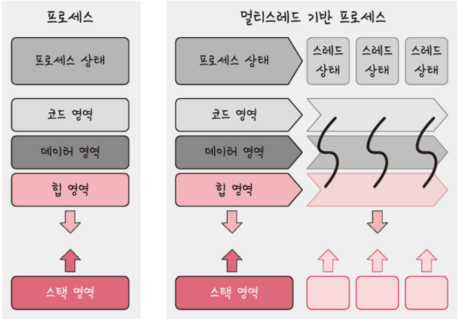
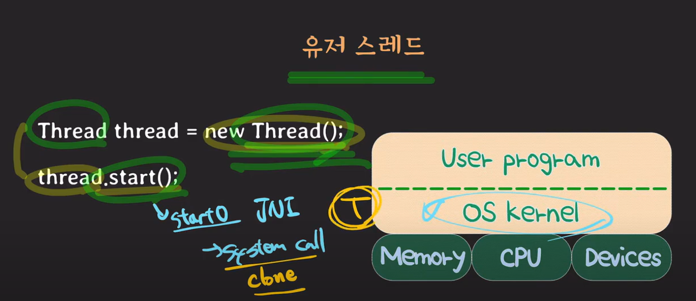
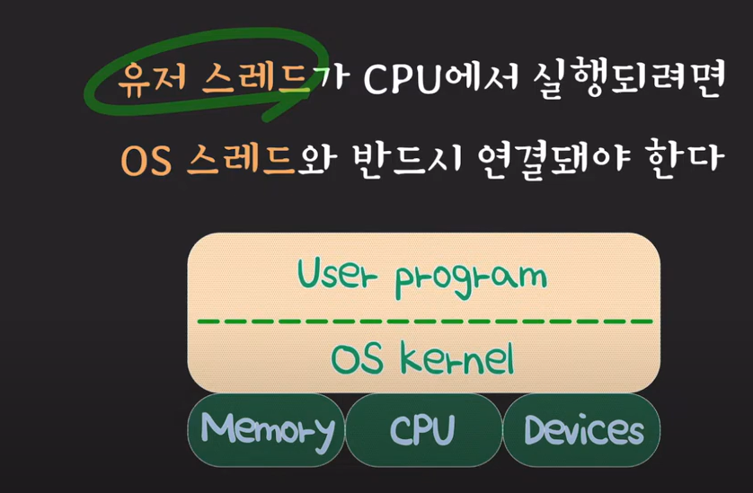
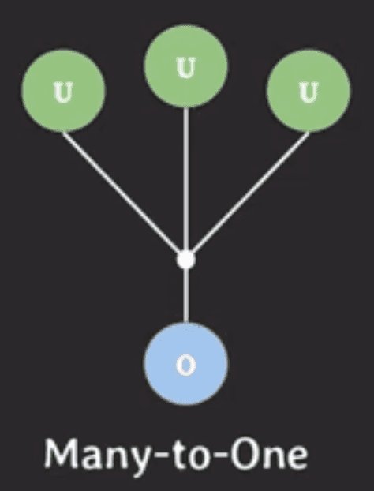
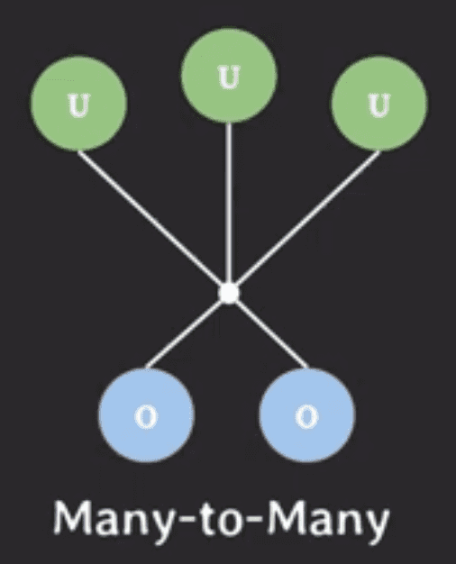

스레드에 대해 설명해주세요.

---

# 스레드(Threade)

- 프로세스의 실행 가능한 가장 작은 단위
- 프로세스는 여러 스레드를 가질 수 있음
- Code, Data, Heap 영역을 서로 공유
- Stack과 같은 그 외의 영역은 각각 생성
- 프로세스의 경우 각각의 메모리 영역(Code, Data, Stack, Heap)을 생성



## 스레드 특징

- 스레드 간 데이터 접근 가능
  - 스레드는 프로세스 내부에 존재하므로 프로세스의 데이터 영역에 접근 가능
  - IPC 필요없이 프로세스의 데이터를 가져올 수 있음
  - 프로세스의 경우 서로의 데이터에 직접적으로 접근 불가능
- 스레드는 일종의 작업 단위
  - 프로세스처럼 작업 처리를 수행할 수 있음
  - 리눅스에선 스레드를 프로세스 취급하여 Light Weight Process라고 부름
  - 스레드도 프로세스처럼 작업을 병렬 처리 가능하여 속도를 높일 수 있음
- 스레드는 일종의 함수로 구현
  - 스레드는 함수이므로 데이터(지역 변수)를 다룸
  - 데이터(지역 변수)를 관리하기 위해 Stack 메모리 영역만 가짐
  - 스레드의 메모리 영역은 Thread Stack이라고 부르며 프로세스의 Stack 메모리 영역과는 별개임
  - 프로세스의 Stack 영역에 스레드의 지역변수가 포함되지 않음
- 하나의 프로세스는 내부에 여러 개의 스레드를 가짐

# 하드웨어 스레드

- 하나의 CPU 코어 내에서 동시에 여러 작업을 처리 
- 하이퍼스레딩 기술을 통해 하나의 코어에서 두 개의 하드웨어 스레드를 실행
- OS 관점에서는 각각의 하드웨어 스레드가 하나의 코어라고 생각

## 하드웨어 멀티스레딩

- 기존 스레드는 CPU가 컨텍스트 스위칭을 수행해야만 여러 스레드를 실행할 수 있음
- 하드웨어 멀티스레딩은 여러 스레드 상태를 CPU에서 동시에 유지
- 스레드의 상태를 복원하는 작업이 필요 없음
- 즉, 스레드 간 전환이 없어도 병렬 처리 가능

## 인텔의 하이퍼 스레딩(Hyper-Threading) 기술

- 대표적인 하드웨어 멀티스레딩 구현
- 각 코어에서 둘 이상의 스레드를 실행할 수 있는 하드웨어 혁신
- 하드웨어 스레드가 많을수록 더 많은 작업을 병렬로 수행(Hardware Multithreading)할 수 있음
- CPU 코어가 여러개의 문맥(Context)를 동시에 유지하여 각 스레드 상태를 별도로 보관
- 컨텍스트 스위칭이 없어도 스레드를 동시에 실행 가능

### 하이퍼 스레딩의 작동 원리

- 인텔® 하이퍼 스레딩 기술을 활성화하면, CPU는 물리적 코어 당 두 개의 실행 컨텍스트를 노출
- 각각의 컨텍스트(하드웨어 스레드)는 하나의 소프트웨어 스레드를 처리 
- 하나의 물리적 코어가 두 개의 "논리적 코어"처럼 작동
- 기존 CPU는 코어가 다른 작업이 완료되기를 기다림(유휴 시간)
- 하이퍼 스레딩 기술를 사용하면 유휴 시간을 활용하여 CPU 처리량을 향상시킬 수 있음
- 두 개의 논리적 코어로 기존의 단일 스레드 코어보다 더 효율적으로 작업

```shell
CPU: Intel Core i7
    ├── 코어 1 (Core 1)
    │   ├── 하드웨어 스레드 1 (Hardware Thread 1)
    │   └── 하드웨어 스레드 2 (Hardware Thread 2)
    ├── 코어 2 (Core 2)
    │   ├── 하드웨어 스레드 1 (Hardware Thread 1)
    │   └── 하드웨어 스레드 2 (Hardware Thread 2)
    ├── 코어 3 (Core 3)
    │   ├── 하드웨어 스레드 1 (Hardware Thread 1)
    │   └── 하드웨어 스레드 2 (Hardware Thread 2)
    └── 코어 4 (Core 4)
        ├── 하드웨어 스레드 1 (Hardware Thread 1)
        └── 하드웨어 스레드 2 (Hardware Thread 2)
```

# OS 스레드와 User 스레드 

- User 스레드는 유저-레벨 스레드라고 불림
- OS 스레드는 커널-레벨 스레드라고 불림
- User 스레드는 OS 스레드와 연결됨

## Kernel-Level Thread; KLT (커널 수준 스레드)

- 운영 체제의 커널이 직접 생성하고 관리하는 스레드
- 스레드의 생성, 스케줄링, 동기화 등의 작업은 모두 커널에서 이뤄짐
- 각 스레드는 커널에 의해 독립적으로 관리
- 하나의 OS 스레드는 하나의 User 스레드로 매핑(1:1)

## User-Level Thread; ULT (사용자 수준 스레드)

- 운영체제 커널이 아닌 사용자 영역에서 스레드 라이브러리를 통해 생성되고 관리
- 스레드 개념을 프로그래밍 레벨에서 추상화
- 커널의 개입 없이 스레드 생성, 스케줄링, 동기화 등의 작업을 수행
- 커널 관점에서는 프로세스로 인식
- 하나의 OS 스레드는 여러 User 스레드로 매핑(1:N)

### User 스레드 예시

1. 자바에서 스레드를 생성
2. <code>thread.start()</code> 함수 실행
3. 내부적으로 <code>start0</code>라는 메서드를 호출
4. <code>start0</code>는 JNI (Java Native Interface)를 통해 OS에 Systemcall 
5. Systemcall을 받으면 Clone을 통해 새로운 프로세스를 생성





## User 스레드와 OS 스레드의 매핑

- User 스레드와 OS 스레드를 연결하는 방법은 크게 세 가지가 있음

### 원투원(One-to-One, 1:1) 모델


- JAVA에서 주로 사용하는 모델
- User 스레드와 OS 스레드를 1:1로 매핑
- 커널이 각 User 스레드를 개별적으로 관리하고 스케줄링
- 병렬 처리가 쉽고 User 스레드가 독립적으로 시스템을 호출하므로 블로킹 되지 않음
- User 스레드 개수만큼 커널 스레드가 필요하여 스레드 생성과 관리에 오버헤드가 큼

### 매니투원(Many-to-One, M:1) 모델



- User 스레드 N개가 1개의 OS 스레드에 매핑
- 하나의 커널이 User 스레드들의 존재를 알지 못한 채로 실행됨
- User 스레드의 스케줄링은 사용자 공간에서 이루어짐
- 스레드 생성과 관리가 빠르고 오버헤드가 적음
- 하나의 유저 스레드가 블로킹되면 해당 커널 스레드에 매핑된 모든 유저 스레드가 블로킹되어 병렬 처리에 제한이 있음

### 매니투매니(Many-to-Many, M)



- GO에서 주로 사용하는 모델
- 여러 User 스레드가 여러 커널 스레드와 매핑
- User 스레드와 커널 스레드의 개수 조정이 가능하여 유연한 스레드 관리와 스케줄링이 가능
- 블로킹 문제를 해결할 수 있어 병렬 처리가 용이함
- 구현이 복잡하고 관리 오버헤드가 있을 수 있음
